# System Design Mastery

> A 16-week mentorship curriculum that teaches you to *talk through* system-design problems, not just solve them.
> Each week gives you a design prompt, then walks through the canonical answer — including the exact phrases a strong candidate uses out loud.

🌟 Star this repo if you're prepping for system-design interviews.

## 🎯 Why this exists

Most system-design prep teaches you *what* to design. This curriculum teaches you the *rhythm* a strong candidate uses to deliver it under interview pressure — clarifying questions, back-of-envelope math, high-level architecture, deep dives, surfaced tradeoffs — all narrated out loud.

## 🧭 The 10-step rhythm

Every answer file follows the same 10 steps, so by Week 03 the rhythm is muscle memory:

```mermaid
---
config:
  look: handDrawn
  theme: neutral
---
flowchart LR
    subgraph scope["First 5 min — Scope it"]
        direction TB
        S1["1. Clarify scope"]
        S2["2. Functional requirements"]
        S3["3. Non-functional requirements"]
        S4["4. Back-of-envelope math"]
    end

    subgraph design["Next 25 min — Design it"]
        direction TB
        S5["5. API design"]
        S6["6. High-level architecture"]
        S7["7. Data model<br/>(or a second deep<br/>dive if the data<br/>model is trivial)"]
    end

    subgraph defend["Final 15 min — Defend it"]
        direction TB
        S8["8. Deep dive on 1-2 components"]
        S9["9. Bottlenecks + scaling"]
        S10["10. Tradeoffs + alternatives"]
    end

    scope --> design --> defend
```

Interleaved through every step: 💬 **"how to say it"** callouts — literal phrases a strong candidate uses.

**On step 7:** the default is a data-model sketch (schema + key choices + access patterns). When the data model is trivial — counters, full-text search, dispatch, payments — substitute a second deep dive on the *next* hardest sub-problem instead. Roughly 10 of the 16 weeks take that substitution; it's noted in each week's `answer.md`.

## 📁 Curriculum

| ☐ | Week | Topic | Difficulty |
|---|------|-------|------------|
| ☐ | 01 | [URL shortener (TinyURL)](week-01-url-shortener) | ⭐ |
| ☐ | 02 | [Pastebin](week-02-pastebin) | ⭐ |
| ☐ | 03 | [Rate limiter](week-03-rate-limiter) | ⭐⭐ |
| ☐ | 04 | [Distributed key-value store](week-04-key-value-store) | ⭐⭐ |
| ☐ | 05 | [News feed (Facebook)](week-05-news-feed) | ⭐⭐ |
| ☐ | 06 | [Twitter timeline](week-06-twitter-timeline) | ⭐⭐⭐ |
| ☐ | 07 | [Search autocomplete](week-07-search-autocomplete) | ⭐⭐ |
| ☐ | 08 | [Web crawler](week-08-web-crawler) | ⭐⭐⭐ |
| ☐ | 09 | [Chat (WhatsApp)](week-09-chat) | ⭐⭐⭐ |
| ☐ | 10 | [Notification system](week-10-notification-system) | ⭐⭐⭐ |
| ☐ | 11 | [Distributed counter (YouTube views)](week-11-distributed-counter) | ⭐⭐⭐ |
| ☐ | 12 | [Live comments (Twitch chat)](week-12-live-comments) | ⭐⭐⭐ |
| ☐ | 13 | [Ride-sharing (Uber)](week-13-ride-sharing) | ⭐⭐⭐⭐ |
| ☐ | 14 | [Video streaming (YouTube)](week-14-video-streaming) | ⭐⭐⭐⭐ |
| ☐ | 15 | [Payments + idempotency (Stripe)](week-15-payments) | ⭐⭐⭐⭐ |
| ☐ | 16 | [Distributed search (Elasticsearch)](week-16-distributed-search) | ⭐⭐⭐⭐ |

## 📋 How each week works

Open the week's folder. You'll find three files:

| File | What it's for |
|------|---------------|
| `readme.md` | The **prompt** — a design problem + constraints. Try it yourself first. |
| `answer.md` | The **walkthrough** — the canonical 10-step answer with "how to say it" coaching. |
| `interviewer-cues.md` | The **meta layer** — what a senior interviewer is *really* listening for. |

**Recommended flow:**

1. Read the prompt in `readme.md`. Set a 45-minute timer.
2. Work through all 10 steps on paper, talking out loud (or recording yourself).
3. Open `answer.md` and compare. Pay attention to the 💬 *how to say it* callouts.
4. Read `interviewer-cues.md` last — that's the layer that distinguishes senior from mid-level.

## 🚀 Getting Started

1. Fork this repo.
2. `git clone` your fork.
3. Open [Week 01: URL Shortener](week-01-url-shortener) and start.

## 🎓 Learning Philosophy

1. **Solve first, read second.** Reading the answer before attempting steals the learning.
2. **Talk out loud.** System design is half communication. Practice the words, not just the boxes.
3. **Numbers, not adjectives.** "Large scale" is meaningless. Show the math.
4. **Surface tradeoffs.** Every design has them. Saying them out loud is half the signal.
5. **Boring tech first.** Reach for Cassandra after you've justified why Postgres won't do.

## 📡 Cross-cutting concern: observability

Every system has the same set of "how do I know it's broken?" questions, regardless of week. Senior interviewers at Google / Meta / Stripe will ask for at least one of these on every problem — surface them in step 9 (bottlenecks) of your answer.

**The four golden signals (Google SRE):**

| Signal | What you measure | Typical alarm |
|---|---|---|
| Latency | p50 / p95 / p99 per endpoint | p99 > N ms for 5 min |
| Traffic | requests / sec | Drop > 50% vs. baseline (silent outage) |
| Errors | 5xx rate, app-level error rate | > 1% for 5 min |
| Saturation | CPU / mem / queue depth / connection pool | > 80% sustained |

**RED for request-driven services:** Rate, Errors, Duration.
**USE for resources:** Utilization, Saturation, Errors.

**SLO budget thinking:** if your SLO is 99.9% over 30 days, your error budget is 43 minutes/month. Burn rate alerts ("budget will be exhausted in N hours at current rate") wake on-call before the SLO is missed.

**Per-week observability prompt:** when you reach step 9 of any answer, narrate:

1. **What's the SLO?** (e.g. "p99 read latency < 100 ms for redirects, 99.95% availability")
2. **What's the leading indicator?** (e.g. "cache hit rate dropping below 90% predicts latency breach")
3. **What's the blast radius?** (e.g. "a single shard going hot affects 1/32 of traffic, not the whole system")
4. **What do you alarm on?** (the metric + threshold + duration window)

Tooling lexicon to know cold: **Prometheus + Grafana** (open source canonical), **Datadog / New Relic / Honeycomb** (commercial), **OpenTelemetry** (vendor-neutral instrumentation), **Jaeger / Zipkin** (distributed tracing), **PagerDuty / Opsgenie** (alert routing).

## 📚 Recommended Reading

- *Designing Data-Intensive Applications* by Martin Kleppmann — the foundation
- *System Design Interview* by Alex Xu — the format
- [The Architecture of Open Source Applications](https://aosabook.org/) — real systems

## 🔗 Contributing

This curriculum is built in the open. If you find an error in an answer, or have a better way to explain something, open a PR.

---

**Ready?** Start with [Week 01: URL Shortener →](week-01-url-shortener)
