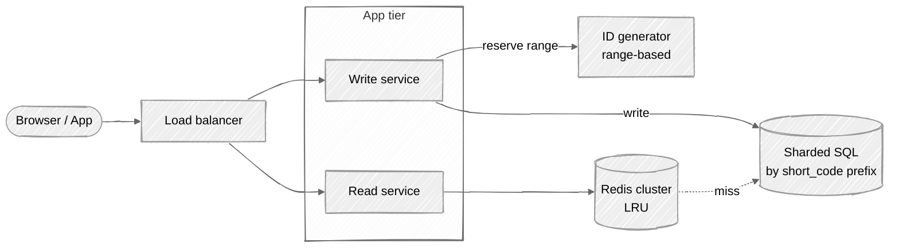
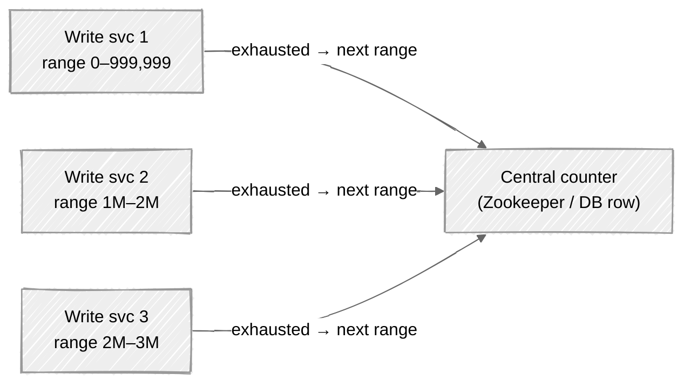

# Week 01: URL Shortener — Walkthrough

> ⏱️ **Time budget:** 45 minutes
> 🎯 **Goal:** Move through the 10 steps with clear communication. You don't need to nail every detail — you need to demonstrate the *rhythm*.

---

## 1. Clarify scope (5 min)

Before drawing a single box, ask the interviewer:

- "Are we designing the public consumer-facing service, or an internal enterprise version?"
- "Should custom aliases be supported, or only auto-generated short codes?"
- "Do URLs expire, or are they permanent?"
- "Are we tracking analytics like click counts?"
- "What's the rough scale we're targeting?"

> 💬 **How to say it:** "Before I start designing, I want to make sure I understand the problem. Let me confirm a few things..."

**Why this matters:** Interviewers want to see that you don't dive into implementation before bounding the problem. Even if they give you nothing, *asking* shows judgment.

## 2. Functional requirements

State your assumptions, in or out.

**In scope:**

- Generate a short URL from a long URL
- Redirect from short URL → long URL
- Custom aliases (optional; takes precedence over auto-generated)
- URLs expire after N years

**Out of scope:**

- User accounts and authentication
- Click-through analytics dashboards (we track counts but no UI)
- Rate limiting (separate problem)

> 💬 **How to say it:** "Here's what I'm planning to design. Anything you want me to add or take out?"

## 3. Non-functional requirements

| Concern | Target | Why |
|---|---|---|
| Scale | 100M new URLs/month, 10× reads | Per problem statement |
| Latency | p99 < 100ms on redirect | Users bounce otherwise |
| Availability | 99.95% (~4h downtime/year) | Redirect failures break upstream services |
| Consistency | Eventual on analytics, strong on URL→long URL mapping | Wrong redirect is unacceptable |
| Security | Short codes shouldn't be enumerable | Predictable codes leak private URLs |

> 💬 **How to say it:** "Now let me think about the qualitative requirements — what does 'good' look like here?"

## 4. Back-of-envelope estimation

| Quantity | Value | Working |
|---|---|---|
| New URLs/sec (avg) | ~40 | 100M / (30 × 86,400) |
| New URLs/sec (peak) | ~400 | 10× average for traffic spikes |
| Reads/sec (avg) | ~400 | 10× write rate |
| Reads/sec (peak) | ~4,000 | 10× average |
| Storage per record | ~500 B | URL ≤ 200 chars + metadata |
| Total storage (5 yr) | ~3 TB | 100M × 12 × 5 × 500 B |
| Cache size (hot 20%) | ~600 GB | Pareto assumption |

> 💬 **How to say it:** "Let me do some quick math so we know what scale we're sizing for. 100M per month is roughly 40 writes per second, and reads are 10× the write rate, so ~400 reads per second average — peaking around 4,000."

**Watch the cache number.** 600 GB doesn't fit on one Redis node, so you'll need a Redis cluster. That's a callback for later.

## 5. API design

Two endpoints — the API should be boring.

```
POST /api/v1/shorten
Request:
  {
    "long_url": "https://example.com/very/long/path?with=query",
    "custom_alias": "my-link",              // optional
    "expires_at": "2030-01-01T00:00:00Z"    // optional
  }
Response (201):
  {
    "short_url": "https://sho.rt/abc1234",
    "short_code": "abc1234",
    "expires_at": "2030-01-01T00:00:00Z"
  }
Error (409): custom_alias already taken
```

```
GET /<short_code>
Response: 302 redirect to long URL
          404 if not found or expired
```

> 💬 **How to say it:** "Two endpoints — one to create, one to redirect. I'm using 302 instead of 301 because we want to be able to update redirects without browsers permanently caching, and we also want accurate click tracking."

**Why 302 not 301:** 301 = permanent (browser caches), 302 = temporary (browser asks every time). 302 lets you change the destination later and enables accurate click tracking.

## 6. High-level architecture



**Why split read and write services?** They have very different traffic shapes (10:1 read/write ratio), latency expectations, and scaling characteristics. Splitting lets you scale each independently.

> 💬 **How to say it:** "I'm splitting reads and writes because the read path is 10× heavier and has tighter latency requirements — I want to be able to add read replicas independently."

## 7. Data model

A single table, sharded by short_code prefix.

```
urls
─────────────────────────────────────────────────────
short_code     VARCHAR(7) PK    base62, 7 chars = 62^7 ≈ 3.5T possibilities
long_url       TEXT             the destination
created_at     TIMESTAMP
expires_at     TIMESTAMP NULL   nullable — many URLs are permanent
custom         BOOLEAN          true if user-chosen alias
─────────────────────────────────────────────────────
SHARD BY first 2 chars of short_code → 62² = 3,844 logical shards
```

**Why SQL, not NoSQL?** Access pattern is key-value, but records are tiny, throughput is moderate (~4k reads/sec), and we get strong consistency for free. Reaching for a NoSQL store here is "looking modern" rather than solving a problem. **Pick boring tech when boring tech works.**

> 💬 **How to say it:** "I'd go with SQL here. The access pattern is key-value, but we don't have a scale or schema-flexibility reason to give up consistency."

## 8. Deep dive: short code generation

The hardest design question in this problem isn't the architecture — it's *how do you generate the short code?*

| Strategy | How it works | Pros | Cons |
|---|---|---|---|
| **Hash of URL** (e.g. MD5) | First 7 chars of hash | Deterministic, dedupes | Collisions; predictable |
| **Random** | 7 random base62 chars | Simple, unpredictable | Need collision check on every insert |
| **Counter + base62** | Increment global counter, base62-encode | No collisions, fast | Predictable (enumerable), counter is SPOF |
| **Counter ranges** ✅ | Each write node reserves a 1M-range of IDs | Fast, no SPOF, no per-write check | Slightly wasted IDs on node death |

**My choice: counter ranges.** Each write service instance reserves a range of 1M integers from a central counter service, base62-encodes them, and serves them out. When the range is exhausted, it asks for the next one.

To handle predictability (enumeration attack), we can XOR the counter with a per-day secret before base62-encoding, or use a Feistel cipher to scramble counter values into the same space.



> 💬 **How to say it:** "I want to call out a tension here — counters are fast and collision-free, but they're enumerable. If we care about not letting attackers walk the namespace, I'd add a scramble step. Worth flagging because for some products that matters and for others it doesn't."

## 9. Bottlenecks + scaling

At 10× scale (1B new URLs/month), where does this break?

| Component | At 1× | At 10× | Fix |
|---|---|---|---|
| Read service | Stateless, scales horizontally | Same | Add boxes |
| Cache | One Redis cluster, hot 20% fits | Hot set is 6 TB | Sharded Redis + CDN for super-hot URLs |
| Write service | Stateless, scales horizontally | Same | Add boxes |
| ID counter | One Zookeeper, ranges of 1M | Still one Zookeeper, hand out larger ranges | Fine; 1B/month is ~33 ranges/sec, easy |
| Database | 4k writes/sec on sharded SQL | 40k writes/sec | Already sharded; scale shards |

**The non-obvious one: CDN for redirects.** A redirect is just "given key, return one of N URLs." That's exactly what a CDN edge cache is for. Put your most popular short URLs at the edge and you serve millions of redirects without touching your own infrastructure.

**Cache stampede (thundering herd).** When a hot URL's cache entry expires, every concurrent request misses simultaneously and hammers the database. Three defenses, in order of operational simplicity:

1. **Single-flight / request coalescing** — only one goroutine/worker fetches; the rest wait on its result. Go's `singleflight`, Java's `Caffeine`, Python's `aiocache` all ship this.
2. **Probabilistic early expiration** — refresh the cache *before* it expires, with probability rising as TTL approaches zero. Cuts the synchronized-miss event.
3. **Stale-while-revalidate** — serve the old value while async-refreshing. Acceptable here because URL→long URL is effectively immutable.

**Observability:** alarm on cache hit rate < 95% (sustained for 5 min) and DB query rate from the read path; both predict imminent latency breach.

> 💬 **How to say it:** "The most impactful scaling move is putting popular short URLs behind a CDN. A 302 redirect is something CloudFront or Fastly can do in 5ms at the edge, and it offloads my read tier entirely for the long tail of hot URLs. The failure mode to guard against is cache stampede — when a hot key expires, single-flight coalescing prevents N concurrent misses from hammering the database."

## 10. Tradeoffs + what you'd change

**What I picked:**

- Counter-range ID generation
- Sharded SQL (not NoSQL)
- Split read/write services
- Cache-aside Redis

**What I chose against:**

- Hash-based IDs (collision handling adds complexity; dedup isn't a stated requirement)
- DynamoDB / Cassandra (no schema-flexibility or scale reason to leave SQL)
- A single combined service (read/write coupling hurts independent scaling)

**Given more time, I'd dig into:**

- The CDN edge-caching layer in detail (TTLs, invalidation on URL expiry)
- Analytics pipeline (a write to Kafka on every redirect, consumed by an OLAP store)
- Soft delete / abuse handling (what about URLs reported as malicious?)

> 💬 **How to say it:** "Those are the major decisions and what I'd revisit if we had more time. Want me to drill into any of those?"

---

## Common pitfalls

- **Jumping into architecture before clarifying scope.** This is the #1 fail.
- **Hand-waving the numbers.** "It'll be big" is not an answer. Show the math.
- **Picking exotic databases by reflex.** "I'd use Cassandra because..." — if you can't finish that sentence with a real reason, just use SQL.
- **Designing for 100× when the prompt said 1×.** Over-engineering signals inexperience too.
- **Not surfacing tradeoffs.** Every design has them. If you don't name them, the interviewer thinks you don't see them.

See [interviewer-cues.md](interviewer-cues.md) for what a senior interviewer is *really* listening for.
