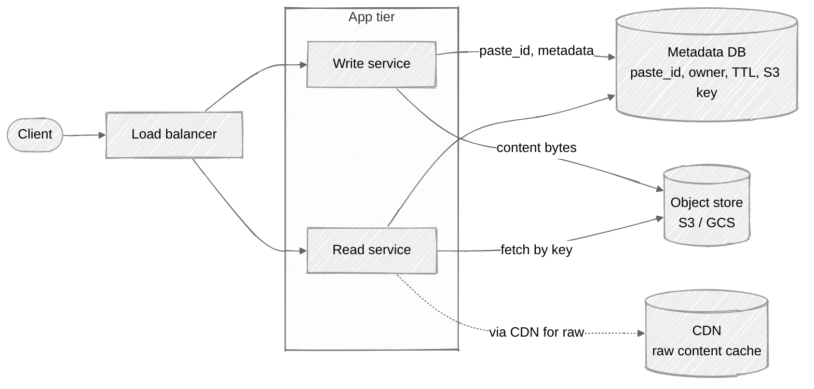

# Week 02: Pastebin — Walkthrough

> ⏱️ **Time budget:** 45 minutes
> 🎯 **Goal:** Recognize this is "URL shortener + blob storage", then design accordingly.

---

## 1. Clarify scope (5 min)

- "Is the content always text, or can users upload binary attachments too?"
- "Maximum paste size — 100 KB? 1 MB? 10 MB?"
- "Are pastes editable after creation, or write-once?"
- "Public, unlisted (link-only), or password-protected — which do we support?"
- "Do we render syntax highlighting on the server, or is that the client's job?"

> 💬 **How to say it:** "This looks like a URL shortener with bigger content — I want to confirm the content size and visibility model before I design."

## 2. Functional requirements

**In scope:**

- Submit a text paste (up to 1 MB), get back a short URL
- Anyone with the URL can read the paste
- Visibility: public (listed), unlisted (link-only), private (auth-gated) — pick one and call it out
- Expiration: never / 1 day / 1 week / 30 days
- View raw or rendered (server returns plain text; client renders)

**Out of scope:**

- User accounts (anonymous pastes for now)
- Search across pastes
- Editing or versioning after creation

> 💬 **How to say it:** "Write-once, link-shareable, with TTL. Let me know if you want versioning — that changes the data model materially."

## 3. Non-functional requirements

| Concern | Target | Why |
|---|---|---|
| Scale | 10M pastes/month, 5× reads | Per problem statement |
| Latency | p99 < 200ms create, p99 < 100ms read | Reads should be CDN-fast |
| Durability | 99.999999999% (11 9s) | Pastes can't disappear; we promised a URL |
| Availability | 99.95% | Standard SaaS |
| Consistency | Read-after-write on the original region | A user expects to see their paste immediately after creating it |

## 4. Back-of-envelope estimation

| Quantity | Value | Working |
|---|---|---|
| New pastes/sec (avg) | ~4 | 10M / 30 / 86,400 |
| Peak writes/sec | ~40 | 10× spike |
| Reads/sec (avg) | ~20 | 5× write |
| Peak reads/sec | ~200 | 10× spike |
| Storage / paste | ~10 KB | average |
| Yearly storage growth | ~1.2 TB | 10M × 12 × 10 KB |
| 5-year storage | ~6 TB | Cheap on S3 |
| Bandwidth out | ~2 MB/s avg | 200 reads/sec × 10 KB |

**Insight:** This is a *small* system. The interesting design decisions aren't about scale — they're about **where the content lives** and **how expiration works**.

> 💬 **How to say it:** "The scale isn't huge — 6 TB over 5 years fits in a single S3 bucket. The interesting questions are storage layout and expiration semantics."

## 5. API design

```
POST /api/v1/pastes
Request:
  {
    "content": "...up to 1MB...",
    "visibility": "public" | "unlisted",
    "expires_in_seconds": 86400,           // optional, null = never
    "syntax": "python"                     // optional hint
  }
Response (201):
  {
    "paste_id": "abc1234",
    "url": "https://pst.io/abc1234",
    "raw_url": "https://pst.io/abc1234/raw",
    "expires_at": "2026-05-20T22:00:00Z"
  }
```

```
GET /<paste_id>           → HTML (rendered with syntax highlighting)
GET /<paste_id>/raw       → text/plain (the original bytes)
```

> 💬 **How to say it:** "Two GET endpoints — one renders, one returns raw. The raw endpoint is what tools like curl will hit."

## 6. High-level architecture

The key insight: **store the content separately from the metadata.**



**Why two stores?** SQL is great for "give me the metadata for paste_id `abc1234`" (millisecond lookup, indexed, transactional). It's terrible for storing 1 MB blobs (bloats the table, hurts cache). S3 is the inverse: cheap durable blob storage with a key/value interface.

> 💬 **How to say it:** "Metadata in SQL, content in S3. The metadata lookup is what's on the hot path; the content fetch streams from S3, and we put a CDN in front of the raw URL so popular pastes don't repeatedly hit our service."

## 7. Data model

```
pastes (SQL)
─────────────────────────────────────────────
paste_id        VARCHAR(7) PK    base62
s3_key          VARCHAR(64)      e.g. "2026/05/19/abc1234"
content_size    INT              for billing/limits
visibility      ENUM(public, unlisted)
syntax          VARCHAR(32) NULL
created_at      TIMESTAMP
expires_at      TIMESTAMP NULL   nullable = never expires
─────────────────────────────────────────────
INDEX (expires_at)               for the TTL sweeper
```

The actual content lives at `s3://pastes/{s3_key}`.

> 💬 **How to say it:** "I'm keeping content out of the database entirely. The DB stores only what we need to *find* the paste."

## 8. Deep dive: expiration

You can't trust the database alone to enforce TTL — even with an `expires_at` column, the rows + blobs still exist until something cleans them up. Three approaches:

| Strategy | How | Pros | Cons |
|---|---|---|---|
| **App-level check** | On every read, compare `expires_at` to now; return 404 if expired | Simple, no background jobs | Data lingers in storage forever (cost) |
| **Scheduled sweeper** | Cron job: `DELETE WHERE expires_at < NOW()` + `DELETE` matching S3 keys | Cleans up storage, simple | Window of "expired but still served" between runs |
| **S3 lifecycle + DB sweeper** ✅ | Set S3 object expiration on write; DB sweeper just for metadata | S3 handles blob cleanup natively, durable, free | Need to align S3 TTL with DB TTL |

**My choice:** When the write service uploads to S3, it sets a per-object lifecycle rule matching `expires_at`. S3 deletes the blob on its own schedule. A nightly DB sweeper deletes the matching rows. Read service double-checks `expires_at` on the read path so we don't serve content during the cleanup window.

> 💬 **How to say it:** "Two-layer expiration — S3 handles blob cleanup natively via object expiration policies, and a nightly job clears DB rows. The read path checks expiry too, so the cleanup window can't leak."

## 9. Bottlenecks + scaling

| Component | At 1× (10M/mo) | At 100× | Fix |
|---|---|---|---|
| Read service | Trivial | Still small | Stateless, add boxes |
| Metadata DB | A single Postgres handles this easily | ~400 writes/sec peak | Read replicas; shard if needed |
| Object store | S3 scales infinitely | Same | Nothing to do |
| Bandwidth | 2 MB/s avg | 200 MB/s avg | CDN absorbs hot pastes |
| Hot paste | One paste goes viral | 100k req/sec to one object | CDN; S3 handles ≥3,500 GET/sec/prefix on its own |

**The interesting one:** when a paste goes viral (Hacker News front page), all reads converge on one S3 object. S3 itself handles this fine, but you don't want every read to traverse your service. Use a CDN on the `/raw` endpoint with a 5-minute TTL.

> 💬 **How to say it:** "S3 absorbs scale natively. The interesting failure mode is a paste going viral — I'd put a CDN in front of the raw endpoint so my service doesn't sit in the request path for popular content."

## 10. Tradeoffs + what you'd change

**What I picked:**

- Metadata in SQL, content in S3 (clean separation)
- S3 lifecycle policies for expiration
- CDN on the raw endpoint
- Anonymous pastes (no auth)

**What I chose against:**

- Storing content in SQL (TEXT/BYTEA): bloats the table, ruins query cache
- A document DB for both metadata and content: gains nothing over the split
- Per-request expiration deletion: leaves orphans, expensive

**Given more time, I'd dig into:**

- Abuse handling (malware in pastes, doxing, GDPR deletion requests)
- Private (auth-gated) pastes — needs a permissions model
- Search across public pastes (Elasticsearch sidecar fed from the write path)
- Editing / versioning (event-sourced history of paste content)

> 💬 **How to say it:** "Those are the calls. The biggest open question is abuse — pastes are a known channel for credential dumps and malware, and you'd want a content-scan pipeline before this hits production."

---

## Common pitfalls

- **Storing 1 MB blobs in a SQL TEXT column.** Works at small scale, kills you at any real scale.
- **Forgetting expiration is a two-system problem.** Setting `expires_at` in SQL doesn't delete the S3 blob.
- **Not noticing the read/write ratio is moderate (5:1).** This isn't a read-mostly system like a URL shortener — you actually need to think about write paths.
- **Adding user accounts to the design when the prompt didn't ask for it.** Scope creep signals inexperience.

See [interviewer-cues.md](interviewer-cues.md) for what an interviewer is *really* listening for.
