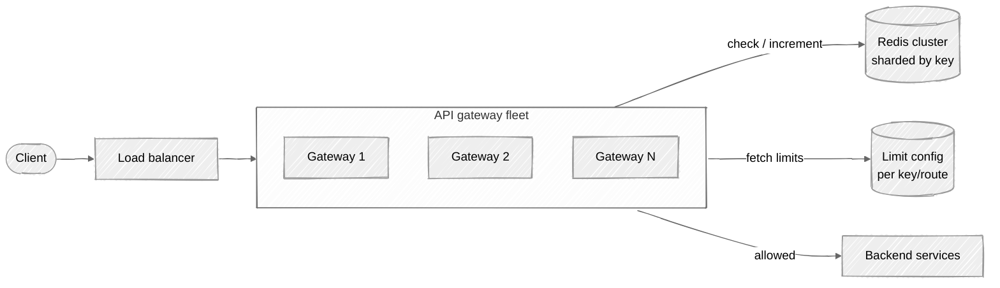

# Week 03: Rate Limiter — Walkthrough

> ⏱️ **Time budget:** 45 minutes
> 🎯 **Goal:** Pick an algorithm with intent, then design the distributed-state layer that makes it actually work.

---

## 1. Clarify scope (5 min)

- "What's the unit of limiting — IP, user ID, API key, or all three?"
- "Is the limit global, per-region, or per-instance?"
- "Are limits the same for every client, or per-tier (free / paid / enterprise)?"
- "What's the action on limit-exceeded — 429 only, or also a queue / retry-after?"
- "Where can the limiter live — at the CDN edge, the API gateway, or each service?"

> 💬 **How to say it:** "Rate limiters can mean very different things — I want to confirm the granularity and where in the stack it lives before I pick an algorithm."

## 2. Functional requirements

**In scope:**

- Reject requests when a client exceeds their per-key quota
- Return `429 Too Many Requests` with `Retry-After` header
- Support multiple limit windows (e.g. 100/min and 5000/hour for the same key)
- Per-route limits (e.g. `POST /charges` is stricter than `GET /charges`)

**Out of scope:**

- Auth / API-key issuance (separate system)
- Billing on overage (separate system)
- DDoS protection at L3/L4 (handled upstream by a WAF/CDN)

> 💬 **How to say it:** "Limiting at the application layer. DDoS and bot-blocking would happen upstream of this in a real system."

## 3. Non-functional requirements

| Concern | Target | Why |
|---|---|---|
| Throughput | 1M req/sec across fleet | Per problem statement |
| Latency overhead | < 5ms added p99 | Anything more and the limiter is the bottleneck |
| Accuracy | Within ~5% of configured limit | Strict accuracy is expensive; small overshoot is fine |
| Availability | 99.99%; **fail-open**, not closed | A broken limiter that rejects everything is worse than no limiter |
| Consistency | Eventual across regions | Per-region accurate is enough; global cross-region adds 100ms+ |

> 💬 **How to say it:** "I want to call out the failure mode now — limiters should fail *open*, not closed. Better to let traffic through than to nuke our own customers when Redis hiccups."

## 4. Back-of-envelope estimation

| Quantity | Value | Working |
|---|---|---|
| Requests/sec | 1M | Per problem |
| Distinct keys | 100k | Per problem |
| Counter reads+writes per request | 2-3 | One per limit window, atomic |
| Redis ops/sec needed | ~2M-3M | 1M req × 2-3 ops |
| Memory per counter | ~100 B | Key + small counter + TTL |
| Total memory | ~10 MB | Trivial; fits in any Redis node |

**Insight:** Memory is a non-issue. The bottleneck is **Redis ops/sec** and **per-request latency**. A single Redis node does 50-100k ops/sec — we'll need a Redis cluster.

> 💬 **How to say it:** "Memory is nothing. What matters is hitting Redis 2-3 million times per second without adding latency — that's the real design constraint."

## 5. API design

The limiter itself doesn't expose an HTTP API to clients — it's a *library or sidecar* the gateway calls. But the gateway exposes:

```
Any incoming HTTP request
  ↓
Gateway middleware:
  allowed, retry_after = limiter.check(key, route)
  if not allowed:
    return 429 Too Many Requests
           Retry-After: {retry_after}
  proceed to backend
```

The limiter library exposes:

```python
limiter.check(key: str, route: str) -> (allowed: bool, retry_after_seconds: int)
limiter.set_limit(key, route, requests, per_seconds)
```

> 💬 **How to say it:** "The limiter is an in-process call from the gateway middleware. Returns allow/deny + retry-after. The decision happens before the request is forwarded."

## 6. High-level architecture



**Why a Redis cluster, not local counters?** Local-only counters mean each gateway instance enforces its own slice of the limit. If you have 10 gateways and a 100 req/min limit, a client can get 1000 req/min by spraying across all 10. Centralized state is the whole point.

> 💬 **How to say it:** "Each gateway calls Redis for the check. Local counters would be faster but they break the limit — a 10-gateway fleet would let 10× through. Redis is the synchronization point."

## 7. Algorithm choice — the deep dive

This is where the interview happens. Four classic algorithms:

| Algorithm | How | Pros | Cons |
|---|---|---|---|
| **Fixed window** | Counter per (key, time bucket); increment, check | Trivial; one INCR | Burst at window edges — 200/min possible if all 100 land in last second of one window + first second of next |
| **Sliding window log** | Store every request timestamp; count timestamps in the window | Exact | Memory grows with traffic; expensive |
| **Sliding window counter** | Hybrid: current-window count + weighted previous-window count | Cheap, accurate enough | Slight inaccuracy in the weighting |
| **Token bucket** ✅ | Bucket holds N tokens; refill at rate R; each request consumes 1 token | Allows bursts up to bucket size, smooths sustained load, well-understood | Slightly more state (tokens + last_refill timestamp) |
| **Leaky bucket** | Requests queue; drained at fixed rate R | Smooths bursts | Doesn't fit HTTP semantics (we want allow/deny, not enqueue) |

**My pick: token bucket.** It matches how customers think ("you can burst up to 100, then sustain 10/sec"), it's cheap to compute, and it's what most production limiters (AWS, Stripe, Cloudflare) actually use.

### Token bucket implementation in Redis

State per (key, route):

```
tokens          float       current tokens in bucket
last_refill_ts  timestamp   last time we recalculated
```

On each request, atomic Lua script:

```lua
-- KEYS[1] = bucket key
-- ARGV[1] = capacity, ARGV[2] = refill_rate (tokens/sec), ARGV[3] = now_ts
local data = redis.call('HMGET', KEYS[1], 'tokens', 'last_refill')
local tokens = tonumber(data[1]) or tonumber(ARGV[1])
local last   = tonumber(data[2]) or tonumber(ARGV[3])

-- Refill
local elapsed = tonumber(ARGV[3]) - last
tokens = math.min(tonumber(ARGV[1]), tokens + elapsed * tonumber(ARGV[2]))

-- Try to consume one
if tokens >= 1 then
  tokens = tokens - 1
  redis.call('HMSET', KEYS[1], 'tokens', tokens, 'last_refill', ARGV[3])
  redis.call('EXPIRE', KEYS[1], 3600)  -- GC stale buckets
  return 1   -- allowed
else
  redis.call('HMSET', KEYS[1], 'tokens', tokens, 'last_refill', ARGV[3])
  return 0   -- denied
end
```

Single round trip, atomic, ~0.5 ms.

> 💬 **How to say it:** "Token bucket implemented as a Redis Lua script. One atomic op per check — refill based on elapsed time, then try to consume. Single round trip keeps the latency overhead in the sub-millisecond range."

## 8. Where to put the limiter — the architectural choice

| Location | When |
|---|---|
| **CDN / WAF edge** | Volumetric protection against IP-level abuse. Pre-auth — coarse. |
| **API gateway** ✅ | Where API keys are validated; perfect spot for per-key quotas. |
| **Per-service** | Internal microservice quotas; usually local counters are fine here. |
| **Client-side** | Useful! Stop generating requests that will be rejected anyway. Use HTTP `429 + Retry-After` to back off. |

A real system uses multiple layers:


**Edge** stops volumetric attacks. **Gateway** is the per-customer SLA enforcement. **Service** protects itself from upstream surge with local circuit breakers.

> 💬 **How to say it:** "I'd put the per-key limiter at the gateway. Volumetric IP limits sit further out at the edge, and each service still keeps a local circuit breaker as defense-in-depth."

## 9. Bottlenecks + scaling

| Component | At 1× | At 10× | Fix |
|---|---|---|---|
| Gateway fleet | Stateless; scales horizontally | Same | Add boxes |
| Redis cluster | 100k ops/sec/node × N nodes | 30M ops/sec | More shards; shard by key hash |
| Limit config | Read-once + cached locally in gateway | Same | Already cached; refresh every N seconds |
| Network to Redis | 0.5 ms RTT | Same | Co-locate Redis with gateway (same AZ) |

**The non-obvious one:** if Redis goes down, do you fail-open or fail-closed? **Fail-open** for application limiters (don't break your customers because Redis hiccuped); **fail-closed** for security limiters (DDoS prevention). Be explicit about which one you're building.

**The other non-obvious one:** for very high-rate clients, batch the limit checks. Don't call Redis on every single request — pre-allocate a token budget to the gateway and refill it. Cuts Redis traffic 100×.

> 💬 **How to say it:** "Two scaling levers — shard Redis more aggressively, or for ultra-high-rate keys, batch the token consumption locally and reconcile every 100ms. Most production limiters do the latter."

## 10. Tradeoffs + what you'd change

**What I picked:**

- Token bucket algorithm
- Redis cluster as the synchronization point
- Gateway-level enforcement
- Fail-open posture

**What I chose against:**

- Fixed window (burst issue at edges)
- Sliding window log (memory cost)
- Local-only counters (breaks the limit under fleet scale)
- Fail-closed (worse customer outcome)

**Given more time, I'd dig into:**

- Multi-region: limits are usually per-region (don't want to add cross-region RTT to the hot path); global limits use a slower aggregation pipeline
- Cost-based limiting: not all endpoints are equal — `POST /charges` might cost 10 tokens, `GET /healthz` 0
- Adaptive limiting: dynamically lower limits when the backend is unhealthy
- Per-tenant fairness inside a shared free tier (token-stealing prevention)

> 💬 **How to say it:** "The most interesting follow-up is cost-based limits — treating endpoints as having different weights. That's how Stripe and GitHub actually work."

---

## Common pitfalls

- **Picking fixed window without realizing the boundary-burst problem.**
- **Local counters across a multi-instance gateway.** Breaks the limit. Surprises everyone.
- **Fail-closed without saying so.** When Redis dies, do you reject all traffic? You need to *choose*, explicitly.
- **Calling Redis with separate GET + SET.** Race condition; another request can read the old value in between. Use atomic Lua.
- **Ignoring per-route weighting.** Real systems care; pretending all endpoints cost the same is a tell.

See [interviewer-cues.md](interviewer-cues.md) for the meta layer.
