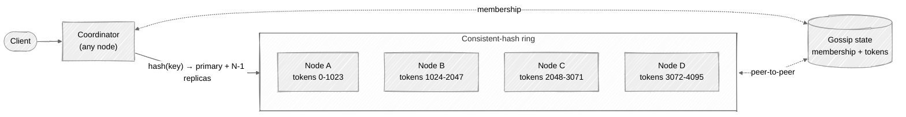
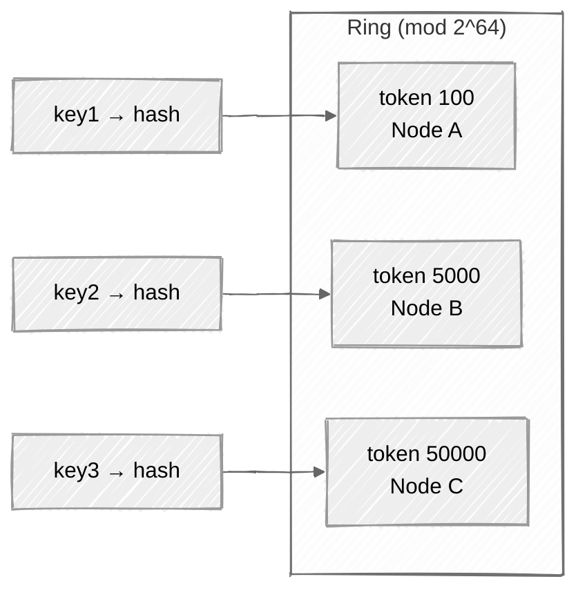
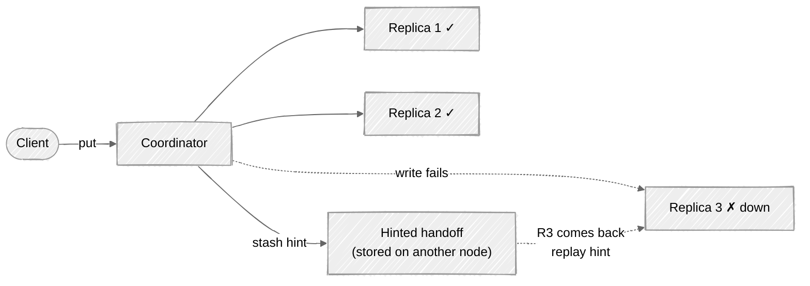

# Week 04: Distributed Key-Value Store — Walkthrough

> ⏱️ **Time budget:** 45 minutes
> 🎯 **Goal:** Reproduce the Dynamo design at a whiteboard level, then defend the consistency tradeoffs.

---

## 1. Clarify scope (5 min)

- "What's the access pattern — pure get/put by key, or also scans / range queries?"
- "Single-region or multi-region from day one?"
- "How big are values — KBs or MBs?"
- "What's the consistency requirement — strong, eventual, or tunable?"
- "Do we need transactions across multiple keys?"

> 💬 **How to say it:** "The two big design forks are (1) what queries we support beyond point lookups, and (2) where we land on the consistency/availability tradeoff. I want to confirm both."

## 2. Functional requirements

**In scope:**

- `get(key)`, `put(key, value)`, `delete(key)` on opaque string keys
- Values up to 1 MB
- Multi-region replication
- Tunable per-request consistency (`ONE`, `QUORUM`, `ALL`)

**Out of scope:**

- Range queries (would need a different data model — see Cassandra wide-rows)
- Multi-key transactions (would need 2PC or a separate consensus layer)
- Secondary indexes
- Pub/sub semantics

> 💬 **How to say it:** "Pure KV with tunable consistency. No scans, no transactions. Those are different products."

## 3. Non-functional requirements

| Concern | Target | Why |
|---|---|---|
| Throughput | 100k ops/sec sustained | Per problem |
| Latency | p99 < 10ms single-region read; < 50ms write (with replication) | Customer-facing storage |
| Durability | 99.999999999% (11 9s) | KV stores back primary data |
| Availability | 99.99% | Per problem |
| Consistency | Tunable; default AP (eventual) | Dynamo model — pick AP to keep writes available during partitions |
| Scale | 10 PB, growing | Linear scaling via adding nodes |

> 💬 **How to say it:** "I'm picking AP from the CAP space — Dynamo-style. That means during a partition, we choose to keep accepting writes and reconcile after. The alternative is CP (e.g. ZooKeeper), which refuses writes during a partition. AP is the right call for a general-purpose KV store; CP is the right call for coordination metadata."

## 4. Back-of-envelope estimation

| Quantity | Value | Working |
|---|---|---|
| Total data | 10 PB | Per problem |
| Replication factor | 3 | Standard |
| Total disk needed | 30 PB | 10 PB × 3 |
| Disk per node | 16 TB SSD | Typical commodity node |
| Nodes (raw) | ~2,000 | 30 PB / 16 TB |
| With overhead (headroom) | ~3,000 | Don't run full |
| Ops/sec / node | ~50 | 100k / 2,000 — easy |
| Network per node | small | Replication is the cost |

**Insight:** This is a *capacity* problem, not a CPU problem. 100k ops/sec is small per-node; storage is what we're sizing for.

## 5. API design

Simple HTTP or gRPC API:

```
GET    /v1/keys/<key>?consistency=quorum
PUT    /v1/keys/<key>
   Body: <opaque value, up to 1 MB>
   Headers:
     X-Replication-Factor: 3        (or use cluster default)
     X-Write-Consistency: quorum
DELETE /v1/keys/<key>
```

Tombstones on delete (for eventual-consistency reconciliation), GC'd after a grace period.

> 💬 **How to say it:** "Three verbs, tunable consistency per request. Delete writes a tombstone — important for the eventual-consistency story, otherwise resurrected values from lagging replicas would feel like the system 'undid' deletes."

## 6. High-level architecture



**Every node can be the coordinator.** Client picks any node (round-robin or geo-routing). That node hashes the key, finds the responsible nodes via the ring, and forwards/replicates.

> 💬 **How to say it:** "All nodes are peers — no master. Any node can coordinate a request. It hashes the key onto the ring, finds the N replicas, and orchestrates the read or write."

## 7. Data partitioning — consistent hashing



**Why consistent hashing, not `hash(key) % N`?** Plain modulo means adding or removing a node re-keys *every* key. Consistent hashing only re-keys keys whose token range moved — about 1/N of the data.

**Virtual nodes (vnodes):** each physical node owns many token ranges, not just one. This smooths out the data distribution and makes rebalancing more granular.

> 💬 **How to say it:** "Consistent hashing with virtual nodes. Plain modulo would mean every node change reshuffles the whole dataset. With vnodes, adding a node moves about 1/N of the data, and the data movement is parallel across many source nodes."

## 8. Deep dive: replication and consistency

This is where the interview lives.

### Replication

Each key is stored on **N replicas** (typically N=3). The primary is the node the key hashes to; the next N-1 nodes clockwise on the ring hold replicas.

### Quorum reads/writes

| Param | Meaning |
|---|---|
| N | Total replicas |
| W | How many must ack a write before we return success |
| R | How many must respond to a read before we return a value |

**Rule:** if `R + W > N`, you get **strong consistency** (the read set and write set overlap, so the read sees the latest write).

| Mode | N | W | R | Tradeoff |
|---|---|---|---|---|
| Strong | 3 | 2 | 2 | R+W>N; one node can be down |
| Fast read | 3 | 3 | 1 | All writes synchronous; fastest reads |
| Fast write | 3 | 1 | 3 | All reads consult all replicas; fastest writes |
| Eventual | 3 | 1 | 1 | Any one node; lowest latency, may read stale |

> 💬 **How to say it:** "I'd default to W=2, R=2 with N=3 — that's quorum, gives strong consistency, and survives one node down. Per-request override lets a client say 'I want fast eventual reads' for things like display data."

### Failure handling

What if a write to one of the replicas fails?



- **Hinted handoff**: coordinator stashes the failed write on a different node, replays when the original recovers.
- **Read repair**: on a read with R>1, if replicas disagree, write the latest value back to the lagging replicas (lazy reconciliation).
- **Anti-entropy with Merkle trees**: nodes periodically compare hashed views of their data; differences trigger a background sync.

> 💬 **How to say it:** "Three layers of repair — hinted handoff catches transient failures, read repair catches lagging replicas on access, and Merkle-tree anti-entropy catches everything else over time."

### Conflicts (concurrent writes)

If two clients write the same key simultaneously to different replicas, you have a conflict. Two approaches:

| Strategy | How | Pros | Cons |
|---|---|---|---|
| **Last-write-wins** | Each write tagged with a timestamp; replicas keep the highest | Simple | Clock skew can lose writes |
| **Vector clocks** | Track causality per replica | Detects true conflicts | Client has to resolve them (or the app does) |

Default to LWW for an interview unless asked otherwise; mention vector clocks as the "correct but harder" alternative.

> 💬 **How to say it:** "LWW by default with NTP-synchronized clocks. Vector clocks are more correct but they push conflict resolution onto the client, and most use cases don't need that level of rigor."

## 9. Bottlenecks + scaling

| Component | At 1× | At 10× | Fix |
|---|---|---|---|
| Per-node ops | 50/sec | 500/sec | Trivial; SSDs handle 100k+ IOPS |
| Storage | 16 TB/node × 3,000 nodes | 30,000 nodes | Linear; just add nodes |
| Gossip overhead | O(log N) | O(log 10N) | Still small |
| Hot key | 1 key getting 100k req/sec | Same | One node can't take it — solve with **client-side caching**, **request coalescing**, or **read-only replicas just for the hot key** |
| Cross-region latency | 100ms+ | Same | Async cross-region replication; clients read from local region |

**The hot key is the famous failure mode.** If one key gets disproportionate traffic, consistent hashing won't save you — all replicas of that key are on the same N nodes. Mitigations: cache layer in front, replicate the hot key wider, or shard the key itself (`user:123:shard:0`, `user:123:shard:1`).

> 💬 **How to say it:** "The interesting failure mode at scale isn't capacity — it's hot keys. Linear scaling solves the average, but one viral key still saturates its replicas. That's where you reach for caching or key-level replication."

## 10. Tradeoffs + what you'd change

**What I picked:**

- AP from CAP (Dynamo model)
- Consistent hashing + vnodes
- Quorum reads/writes, N=3 W=2 R=2 default
- LWW for conflict resolution
- Hinted handoff + read repair + Merkle anti-entropy
- Peer-to-peer; no master

**What I chose against:**

- CP design (e.g., Spanner, etcd): great for coordination, wrong for general-purpose KV
- Single-master with replicas: failover becomes the SPOF
- Modulo-based partitioning: rebalancing nightmare
- Vector clocks by default: extra complexity for marginal benefit

**Given more time, I'd dig into:**

- Cross-region replication topologies (full mesh vs. ring vs. hub-and-spoke)
- Compaction strategy (LSM-tree internals — SSTables, leveled vs. size-tiered)
- Repair scheduling (don't run anti-entropy during peak)
- Multi-region consistency (last-write-wins with hybrid logical clocks)

> 💬 **How to say it:** "Those are the big calls. The most interesting follow-up would be cross-region — Dynamo solves it with async replication and 'global tables,' but the conflict story gets harder when partitions can last hours."

---

## Common pitfalls

- **Using `hash(key) % N`** — kills you on rebalance.
- **Picking CP without realizing it.** "I'll just use Raft" is a different design.
- **Forgetting tombstones.** Deleted values resurrect from lagging replicas.
- **Hand-waving anti-entropy.** "Eventually consistent" without a mechanism is just "eventually corrupted."
- **Ignoring hot keys.** They're the failure mode that actually breaks production.

See [interviewer-cues.md](interviewer-cues.md).
