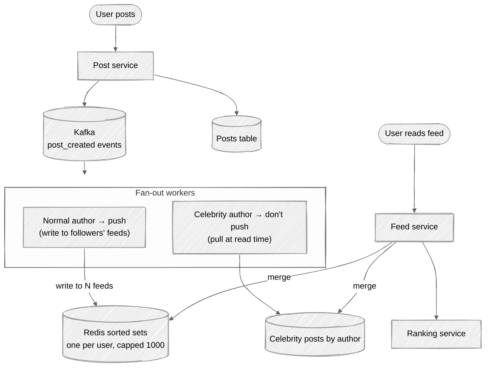
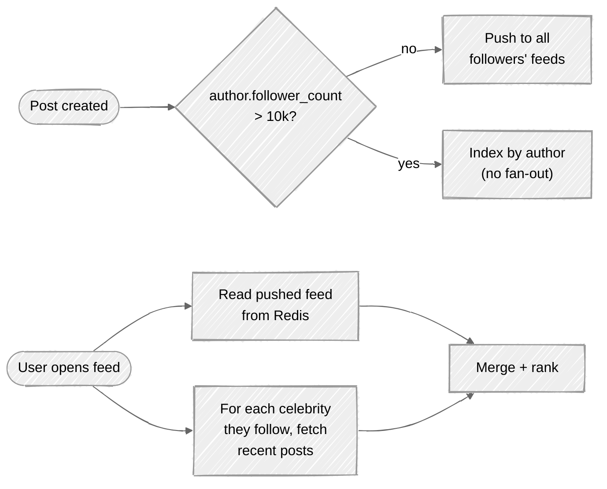

# Week 05: News Feed — Walkthrough

> ⏱️ **Time budget:** 45 minutes
> 🎯 **Goal:** Land on hybrid fan-out (push for most, pull for celebrities), then explain ranking.

---

## 1. Clarify scope (5 min)

- "Is the feed strictly chronological, or ranked by relevance?"
- "How fresh — sub-second, or 'recent within minutes' is fine?"
- "Are posts text-only, or media-rich (images, videos)?"
- "Do we support comments and reactions in the feed, or just the original posts?"
- "What's the max follow count per user?"

> 💬 **How to say it:** "The biggest fork is chronological vs. ranked — ranked needs a feature pipeline that chronological doesn't. I want to confirm that before designing."

## 2. Functional requirements

**In scope:**

- Generate a personalized feed of recent posts from followed accounts
- Ranked by relevance (mix of recency + engagement signals)
- Create a post → it eventually shows up in followers' feeds
- Pagination ("show more")
- Pull-to-refresh

**Out of scope:**

- Post creation itself (separate service)
- Comments, reactions, sharing (referenced but not designed here)
- Notifications (separate service)
- Ad insertion (would be a re-ranking step in production)

> 💬 **How to say it:** "Personalized, ranked feed. Post creation lives elsewhere and emits an event we consume."

## 3. Non-functional requirements

| Concern | Target | Why |
|---|---|---|
| Feed load latency | p99 < 300ms | Users abandon a slow feed |
| Post-to-feed latency | < 5s for normal users; minutes OK for celebrities | Acceptable freshness vs. cost tradeoff |
| Availability | 99.95% | Customer-facing |
| Consistency | Eventual | Feed showing a post 5 seconds late is fine |
| Scale | 200M DAU, 100M posts/day | Per problem |

## 4. Back-of-envelope estimation

| Quantity | Value | Working |
|---|---|---|
| Posts/sec (avg) | ~1,200 | 100M / 86,400 |
| Feed reads/sec (avg) | ~12,000 | 10× write |
| Feed reads/sec (peak) | ~120,000 | 10× avg |
| Avg followers per user | ~300 | Per problem |
| Naive fan-out writes/post | 300 | One write per follower's timeline |
| Fan-out write rate (avg) | 360k writes/sec | 1,200 × 300 |
| Fan-out write rate at peak | 3.6M writes/sec | 10× peak |
| Avg feed size cached | 1,000 posts × 1 KB = 1 MB/user | Top of feed only |
| Total feed cache | 200 TB | 200M users × 1 MB |

**Insight:** Naive push fan-out is *expensive* — 360k writes/sec average for the timeline cache. And then there are celebrities — a single Justin Bieber post would generate 100M writes for one post.

> 💬 **How to say it:** "The fan-out write number is what's scary. 1,200 posts/sec × 300 followers = 360k timeline writes per second, *and* that's before celebrities. That's the design pressure."

## 5. API design

```
GET /api/v1/feed?cursor=<opaque>&limit=20
Response:
  {
    "posts": [{ post_id, author, content, created_at, score }],
    "next_cursor": "..."
  }

POST /api/v1/posts
Request: { content, media_url, ... }
Response: { post_id }
```

The feed service is read-only from the client's perspective; post creation is a separate write path that emits a `post_created` event.

> 💬 **How to say it:** "Feed reads return paginated posts. Post writes go to a different service and emit an event that the feed pipeline consumes."

## 6. High-level architecture — hybrid fan-out



The key idea: **push for normal users, pull for celebrities, merge at read time.**

> 💬 **How to say it:** "Normal users push — when they post, fan-out workers write the post_id to each follower's timeline cache. Celebrities don't push — that would be 100M writes for one post. Instead, the read path merges in celebrity posts on demand."

## 7. Data model

```
posts (sharded by post_id)
─────────────────────────────────────────────
post_id        BIGINT PK (snowflake)
author_id      BIGINT
content        TEXT
media_url      TEXT NULL
created_at     TIMESTAMP

follows (sharded by follower_id)
─────────────────────────────────────────────
follower_id    BIGINT
followee_id    BIGINT
created_at     TIMESTAMP
PK (follower_id, followee_id)

celebrities (small table)
─────────────────────────────────────────────
user_id        BIGINT PK
follower_count BIGINT
```

**Redis timeline cache:** per-user sorted set, score = `created_at` (or computed relevance score), capped at 1000 entries.

```
ZADD feed:{user_id} {score} {post_id}
ZADD feed:{user_id} {score} {post_id} ... (one ZADD per post)
ZREMRANGEBYRANK feed:{user_id} 0 -1001   # trim to 1000
```

## 8. Deep dive: the celebrity threshold

When does an account become a "celebrity" for fan-out purposes?

**Naive:** flag accounts with > N followers (say N=10,000). For those, skip the push.

**Better:** the threshold is cost-based — fan-out is worth it as long as `cost(push) < cost(pull) × probability_followers_read_feed`.

For a celebrity with 100M followers, the push costs 100M writes. The pull, for each follower who reads their feed, costs one extra query (read recent celebrity posts and merge). If even 1% of followers read their feed in the next hour, pull is cheaper than push.



> 💬 **How to say it:** "Hybrid threshold around 10k followers — adjustable. Below threshold, push at write time. Above, store by author and merge in at read time. The number isn't sacred; it's a knob you tune based on the cost ratio."

### Ranking

Chronological ordering is trivial — `ORDER BY created_at DESC`. *Ranked* feeds are a different beast:

1. **Candidate generation** — pull the last N posts from followed accounts (~1000 candidates)
2. **Feature extraction** — for each post, gather signals: poster affinity, time decay, predicted engagement, content type, etc.
3. **Scoring** — ML model predicts pCTR (probability of click), pComment, pShare; combined into a score
4. **Re-ranking** — diversification (don't show 10 posts from the same person), promoted content insertion, business rules

The ranking pipeline runs *per request* on the candidate set. Models served from a feature store + serving system (TensorFlow Serving, or whatever).

> 💬 **How to say it:** "I'm not designing the ML pipeline here, just calling out the pipeline shape — candidate gen → features → model scoring → re-rank. The first two are the system-design problem; the model itself is a separate problem."

## 9. Bottlenecks + scaling

| Component | At 1× (200M DAU) | At 10× (2B DAU) | Fix |
|---|---|---|---|
| Fan-out workers | 360k writes/sec | 3.6M writes/sec | Stateless; scale Kafka consumers |
| Redis timeline cache | 200 TB | 2 PB | Sharded Redis; each user's feed is independent |
| Celebrity store | Tiny | Tiny | Nothing — celebrities are < 0.01% of users |
| Read path | 120k reads/sec peak | 1.2M reads/sec | Stateless; scale read service |
| Ranking | Per-request ML inference | Same | Tier the model — cheap model for most users, expensive for engaged users |

**The non-obvious bottleneck:** the merge step. Reading 1,000 posts from a user's pushed timeline + the last 50 posts from each of their 10 celebrity follows = up to 1,500 posts to merge and rank per request. At 1.2M req/sec, that's a lot of work. Solutions:

- Cap the merge set aggressively (top 500 candidates total).
- Precompute the celebrity-posts cache (one Redis list per celebrity, capped, shared by all their followers).
- Cache the *output* feed per user for short windows (60 seconds) — popular for less-active users.

> 💬 **How to say it:** "The hot path at scale is the read-side merge. Cap candidate sets aggressively, cache celebrity posts in shared lists, and consider caching the final ranked feed for short windows for less-active users."

## 10. Tradeoffs + what you'd change

**What I picked:**

- Hybrid fan-out (push + pull)
- Redis sorted sets for timeline cache
- Ranking pipeline as a separate stage
- Eventual consistency (~5s post-to-feed latency)

**What I chose against:**

- Pure push: dies on celebrities
- Pure pull: reads are too slow (must hash-join 300 followed users every time)
- Strong consistency: too expensive, no product benefit
- Synchronous fan-out (in the post API request): would slow post creation

**Given more time, I'd dig into:**

- Multi-region (feeds are heavily geo-local; replicate by region)
- Edits and deletes (need to invalidate or rewrite cached timelines)
- Anti-spam / abuse signals as a re-ranking input
- Feed freshness vs. interestingness tradeoff (real-feed vs. "best of last 24h")

> 💬 **How to say it:** "Those are the calls. The deepest follow-up worth flagging is post-edit propagation — when someone edits or deletes a post that's already in 300 timelines, you have to think about cache invalidation, and lazy invalidation on read is usually the right answer."

---

## Common pitfalls

- **Picking pure push without thinking about celebrities.** Will get demolished by the follow-up.
- **Picking pure pull because "writes are cheaper."** Doesn't hit the latency budget on read.
- **Designing the ML model.** You're a systems designer, not an ML engineer. Treat ranking as a black box.
- **Ignoring deletes / edits.** Cache invalidation is a real problem.
- **Not splitting the read and write services.** They have completely different load shapes.

See [interviewer-cues.md](interviewer-cues.md).
