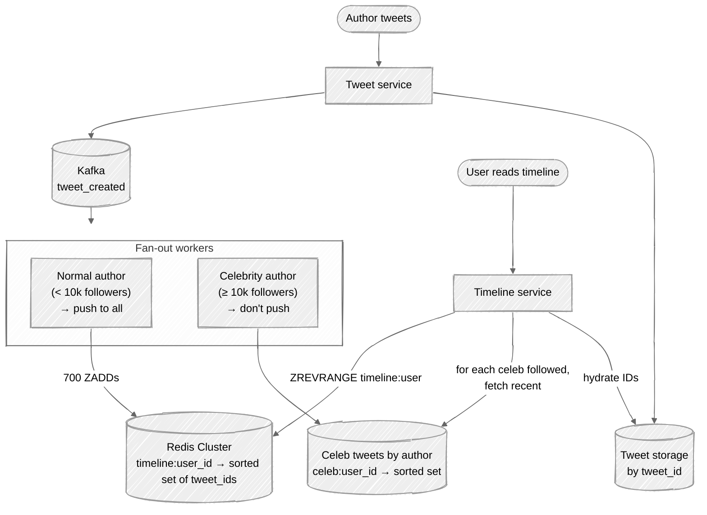

# Week 06: Twitter Home Timeline — Walkthrough

> ⏱️ **Time budget:** 45 minutes
> 🎯 **Goal:** Reproduce Twitter's hybrid fan-out at whiteboard level, then defend the celebrity threshold and timeline-cache structure.

---

## 1. Clarify scope (5 min)

This problem is similar to [Week 05 News Feed](../week-05-news-feed/), but Twitter has its own constraints worth confirming:

- "Chronological 'latest' tab, ranked 'for you' tab, or both?"
- "Do we cover quote-tweets and retweets, or just original tweets?"
- "Is the latency budget for the initial timeline load, or also infinite scroll pagination?"
- "Read receipts / 'mark as seen' — in scope?"
- "What does 'tweet visibility' mean — public-only, or do we handle protected accounts?"

> 💬 **How to say it:** "Twitter is the canonical version of news-feed-style design. The interesting twist here is that the celebrity problem is *much* more extreme — one tweet from a top account fans out to 100M+ followers."

## 2. Functional requirements

**In scope:**

- "Latest" timeline: chronological tweets from followed accounts
- Posting a tweet → eventually visible in followers' timelines
- Pagination (infinite scroll)
- Public tweets only (skip protected-account complexity)

**Out of scope:**

- The "For You" ranked timeline (different system; reuses our infrastructure but adds an ML re-ranking layer)
- Replies, quote-tweets as standalone surfaces
- Notifications, search, DMs (separate services)
- Trending topics

> 💬 **How to say it:** "I'll design the chronological 'latest' timeline. The ranked 'for you' feed reuses this same infrastructure with a re-ranking step on top."

## 3. Non-functional requirements

| Concern | Target | Why |
|---|---|---|
| Timeline read latency | p99 < 200ms | Twitter is famously demanding here |
| Tweet-to-timeline latency | < 5s for normal accounts; up to minutes for celebrities | Acceptable lag for celebrities |
| Read availability | 99.99% | Service-critical |
| Write availability | 99.9% | OK to drop a tweet write in extreme cases |
| Scale | 200M DAU, ~3,500 tweets/sec sustained | Per problem |

## 4. Back-of-envelope estimation

| Quantity | Value | Working |
|---|---|---|
| Tweets/sec (avg) | ~3,500 | 300M / 86,400 |
| Tweets/sec (peak) | ~35,000 | Election night, Super Bowl |
| Timeline reads/sec | ~50,000 | 200M DAU pulling feed ~20× per day |
| Timeline reads/sec (peak) | ~500,000 | 10× spike |
| Avg followers | ~700 | Twitter's published number |
| Fan-out writes/sec naive push | ~2.5M | 3,500 × 700 |
| Fan-out writes/sec at peak | ~25M | The infamous Twitter number |
| Celebrity tweets/sec | ~10 | The top accounts collectively |
| Celebrity fan-out if pushed | 10 × 100M = 1B writes/sec | Catastrophic |
| Per-user timeline cache size | 800 tweet_ids × 8 bytes = 6.4 KB | Tiny |
| Total timeline cache | ~1.3 TB | 200M × 6.4 KB — easy |

**Insight:** the timeline cache itself is *tiny*. What's painful is the *fan-out write rate*, and the celebrity case makes pure push impossible.

> 💬 **How to say it:** "The cache is small — just IDs. What dominates is the fan-out write rate. 2.5 million writes per second average, 25 million at peak, *plus* the celebrity case which would push past 1 billion writes per second if we pushed naively. That's why hybrid fan-out exists."

## 5. API design

```
GET /api/v1/timeline?cursor=<opaque>&count=20
Response:
  {
    "tweets": [{ tweet_id, author_id, text, created_at, ... }],
    "next_cursor": "..."
  }

POST /api/v1/tweets
Request: { text, media_id?, in_reply_to? }
Response: { tweet_id }
```

`tweet_id` is a Snowflake — time-sortable, so cursor pagination works naturally.

> 💬 **How to say it:** "Tweet IDs are Snowflakes — 64-bit, time-sortable. That means timeline pagination is just 'give me IDs less than the previous cursor,' no separate sort needed."

## 6. High-level architecture — hybrid fan-out



**Two stores, two paths.** Below threshold → push. At/above threshold → store by author, merge on read.

> 💬 **How to say it:** "Hybrid. Normal authors push — write workers receive the Kafka event and ZADD the tweet_id into each follower's timeline. Celebrities don't push. We store their tweets indexed by author. At read time, we union the user's pushed timeline with the celebrities they follow."

## 7. Data model

```
tweets (sharded by tweet_id)
─────────────────────────────────────────────
tweet_id     BIGINT PK (Snowflake)
author_id    BIGINT
text         VARCHAR(280)
media_id     BIGINT NULL
in_reply_to  BIGINT NULL
created_at   TIMESTAMP

follows (sharded by follower_id)
─────────────────────────────────────────────
follower_id  BIGINT
followee_id  BIGINT
created_at   TIMESTAMP
PK (follower_id, followee_id)

INDEX follows by (followee_id, follower_id)   -- for "who follows me" lookups
```

**Redis (timeline cache):**

```
ZADD timeline:{user_id} {tweet_id} {tweet_id}    (score = tweet_id, which is time-sortable)
ZREMRANGEBYRANK timeline:{user_id} 0 -801        # cap at 800 entries
TTL = 30 days (recompute if stale)
```

**Redis (celebrity author cache):**

```
ZADD celeb:{author_id} {tweet_id} {tweet_id}
LTRIM to last 200 tweets per celeb
```

## 8. Deep dive: the celebrity threshold

The single most consequential number in this design is the celebrity threshold.

| Threshold | Cost trade |
|---|---|
| Too low (1k followers) | Too many "pull merges" on read; pull path expensive |
| Too high (1M followers) | Push fan-out still huge for 10k-follower accounts |
| Just right (~10k–20k) | Most accounts push cheaply; a few hundred celebrities pull |

The threshold isn't sacred — it's a knob you tune based on the observed cost ratio. Twitter has publicly described values in the 10k–100k range, varying over time.

### Two-tier fan-out

You can refine further:

| Tier | Followers | Strategy |
|---|---|---|
| Tier 1 | < 10k | Push to all immediately |
| Tier 2 | 10k–1M | Async push with delay (lower priority queue) |
| Tier 3 | ≥ 1M | Don't push at all; merge on read |

> 💬 **How to say it:** "The threshold is a cost-ratio knob. Most accounts are tier 1 — push immediately. Tier 3 is celebrities — pull on read. The interesting case is tier 2 where you push but with a delay so peak-time celebrities don't starve normal users' fan-out workers."

### What the merge looks like at read time

```python
# Pseudocode
def get_timeline(user_id, cursor=None, count=20):
    # 1. Read the pushed portion
    pushed = redis.zrevrange(f"timeline:{user_id}", 0, 1000)

    # 2. Find followed celebrities
    celebs = follows.where(follower=user_id).where(followee.is_celebrity)

    # 3. Pull recent tweets from each followed celebrity
    celeb_tweets = []
    for celeb in celebs:
        celeb_tweets += redis.zrevrange(f"celeb:{celeb.id}", 0, 50)

    # 4. Merge + sort by tweet_id desc
    merged = sorted(pushed + celeb_tweets, reverse=True)[:1000]

    # 5. Hydrate
    return tweets.get_by_ids(merged[:count])
```

The merge is fast because tweet_ids are time-sortable (Snowflake), so sorting is O(n log n) on a small set.

> 💬 **How to say it:** "Read = pushed timeline + per-celebrity pulls, merged by time-sortable ID. Pulls hit a Redis sorted set per celebrity that's shared by all their followers — one cache entry per celebrity, not per follower."

## 9. Bottlenecks + scaling

| Component | Hot spot | Mitigation |
|---|---|---|
| Fan-out workers | 25M writes/sec at peak | Stateless; partition by follower_id; Kafka consumer groups scale linearly |
| Redis timeline cache | Per-user shard hotness | Consistent-hash by user_id; ~1k Redis nodes |
| Celebrity cache | Top celebrities have insane read rates | Replicate hot celeb keys across multiple Redis shards |
| Read service | 500k req/sec peak | Stateless; cache the *merged* timeline for short windows for inactive users |
| Hydration of tweet content | One DB lookup per ID | Cache tweets in Memcached / Redis with 1-day TTL |

**The non-obvious bottleneck:** the celebrity merge. A user who follows 50 celebrities pays 50 cache fetches per timeline read. Pipelining helps; batched MGET reduces RTTs. Beyond that, you can precompute a "celebrities-I-follow" feed per user, updated when they follow/unfollow.

> 💬 **How to say it:** "The merge at read time is the part that can quietly grow expensive. Pipeline the celebrity fetches with MGET, and for users who follow many celebrities, precompute a 'celeb feed' that's a merge of their celeb-only timelines. Refreshed when their follow graph changes."

## 10. Tradeoffs + what you'd change

**What I picked:**

- Hybrid push + pull
- Snowflake tweet IDs (time-sortable; no separate sort column)
- Per-celebrity shared cache (not per-follower)
- Eventual consistency

**What I chose against:**

- Pure push (Bieber-tweet annihilates fan-out)
- Pure pull (read latency explodes for users with many follows)
- Strong consistency (no product reason)
- Materializing the full timeline on write

**Given more time, I'd dig into:**

- The "for you" ranked timeline (re-ranking step on top of this infrastructure)
- Geolocation-aware fan-out (most followers are in the same time zone as the author; can prioritize)
- Edits — Twitter eventually shipped this; cache invalidation by tweet_id with a "dirty" flag
- Retweet handling — does a retweet propagate as a separate fan-out?

> 💬 **How to say it:** "Those are the calls. The most interesting follow-up is the 'for you' ranking — it reuses this infrastructure but adds a re-ranking step that pulls in candidate tweets from outside the follow graph entirely."

---

## Common pitfalls

- **Pure push.** The interviewer is *waiting* for you to draw it. Don't.
- **Pure pull.** Equally a trap; latency explodes.
- **One Redis instance.** It's 1.3 TB minimum.
- **Forgetting that tweet IDs are sortable.** Snowflake gives you free chronological ordering.
- **Synchronous fan-out in the tweet API.** The API would block until 700+ writes complete.

See [interviewer-cues.md](interviewer-cues.md).
