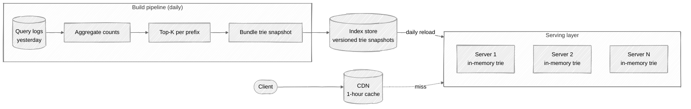
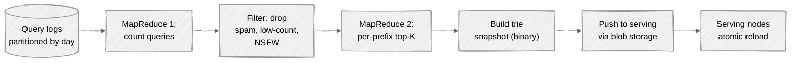

# Week 07: Search Autocomplete — Walkthrough

> ⏱️ **Time budget:** 45 minutes
> 🎯 **Goal:** Build a trie with precomputed top-K per prefix, then defend the batch/real-time tradeoff.

---

## 1. Clarify scope (5 min)

- "Where do the suggestions come from — user query history, a curated corpus, or both?"
- "Per-user personalization, or one global top-K?"
- "How fresh — minutes, hours, or daily-batch is fine?"
- "Single language, or do we handle Chinese/Japanese (where prefix is character-level)?"
- "Spell correction expected, or strict prefix match?"

> 💬 **How to say it:** "Autocomplete is a deceptively narrow problem — the freshness and personalization requirements dominate the architecture. I want to pin those down first."

## 2. Functional requirements

**In scope:**

- Given a prefix, return top 5–10 suggestions
- Suggestions ranked by global popularity (yesterday's query volume)
- Daily refresh of the suggestion index
- Multi-region deployment
- Strict prefix matching (no fuzzy / spell correction)

**Out of scope:**

- Per-user personalization (acknowledged as a follow-on layer)
- Real-time popularity (within-minute updates) — daily refresh is the brief
- Spell correction / typo tolerance
- Multi-character-set complexity (assume Latin/ASCII)

## 3. Non-functional requirements

| Concern | Target | Why |
|---|---|---|
| Latency | p99 < 50ms end-to-end (network + service) | Slow autocomplete is unusable |
| Throughput | ~1.2M QPS sustained globally | 100B/day ÷ 86,400 |
| Index freshness | Daily refresh | Per the brief |
| Availability | 99.9% | Slightly relaxed — autocomplete isn't critical-path |
| Cost | Low per-query | Margin matters at 100B/day |

## 4. Back-of-envelope estimation

| Quantity | Value | Working |
|---|---|---|
| QPS (avg) | ~1.2M | 100B / 86,400 |
| QPS (peak) | ~5M | Daytime concentration |
| Average prefix length | 1-5 chars | User types and pauses |
| Distinct queries indexed | ~10M | Most autocomplete corpora are this size |
| Trie size (10M strings, avg 15 chars) | ~150 MB raw; ~500 MB with structure | Fits in memory |
| Top-K per prefix (precomputed) | 5 strings × 15 chars × maybe 1M prefixes = 75 MB | Easily fits |

**Insight:** the entire serving index fits in one machine's RAM. The interesting challenges are *building* the index efficiently and *serving* it at global scale with low latency.

> 💬 **How to say it:** "The serving footprint is small — under a gigabyte. The hard parts are (a) building the index from yesterday's logs at scale, and (b) serving at low latency globally."

## 5. API design

```
GET /api/v1/autocomplete?q=net&limit=10
Response:
  {
    "suggestions": [
      { "text": "netflix", "rank": 1 },
      { "text": "netflix login", "rank": 2 },
      { "text": "network", "rank": 3 },
      ...
    ]
  }
```

Cache headers: `Cache-Control: public, max-age=3600` (one-hour CDN cache is fine).

> 💬 **How to say it:** "Simple GET, CDN-friendly. Same prefix from many users gets the same answer for the day, so caching at the edge is a huge win."

## 6. High-level architecture



Two halves: **serving** (in-memory trie, replicated horizontally) and **building** (daily batch over query logs).

> 💬 **How to say it:** "I'm splitting this cleanly into a daily build pipeline and a serving layer. Serving is stateless reads against an in-memory trie. The build runs once a day on yesterday's query logs and emits a versioned snapshot that the serving layer downloads."

## 7. Data structure: trie with top-K per node

The classic answer is a trie. Each node stores the top-K most popular completions whose path passes through it.

```
                       (root)
                      /  |  \
                     n   r   ...
                    / \
                   e   o
                  /
                 t
                / \
               f   w
              /     \
            (lix)   (ork)
            top-K:   top-K:
            netflix  network
            netflix  networking
            ...      ...
```

At query time:

1. Walk the trie following the user's prefix characters
2. Return the top-K list stored at that node

This is **O(prefix_length)** — typically 1-15 chars. Sub-millisecond on in-memory data.

**Why store top-K *at each node*, not compute on the fly?** The compute-on-the-fly version requires DFS from the node — for popular prefixes the subtree is huge. Precomputed top-K is a fixed-size lookup.

### Building the trie

Pseudocode:

```python
def build_trie(query_counts):  # query_counts: dict[query] -> count
    trie = TrieNode()
    for query, count in query_counts.items():
        for i in range(1, len(query) + 1):
            prefix = query[:i]
            node = trie.walk(prefix)
            node.top_k.consider(query, count)  # min-heap of size K
    return trie
```

For 10M queries × avg 15 prefix variants = 150M (prefix, query) insertions. Big but tractable for a batch job.

> 💬 **How to say it:** "Each trie node stores the top-K completions whose path passes through. Query time is O(prefix length) — sub-millisecond. The build is a batch MapReduce-style job over yesterday's logs."

## 8. Deep dive: build pipeline + freshness



**Atomic snapshot reload** is critical. Each serving node:

1. Downloads the new snapshot to disk
2. Builds the new trie in memory (a few seconds)
3. Swaps the reference atomically (next request hits the new trie)
4. Frees the old one

No serving downtime. If the new build is bad, you can roll back by pointing at yesterday's snapshot.

### Real-time updates (when daily isn't fresh enough)

If the brief required minute-fresh suggestions, you'd add a **delta** layer:

- Daily snapshot = the heavy-iron baseline
- Real-time stream from Kafka of just-typed queries
- Streaming job updates a *delta trie* in memory
- Query results = merge(daily trie, delta trie)

The delta is small (only the last few hours of new popularity); merge is cheap.

> 💬 **How to say it:** "Daily is what the brief asked for. If we needed minute-fresh, I'd add a delta layer — a streaming job updates a small trie of recent activity, and queries merge daily + delta. That's how Google trends-aware suggestions work."

## 9. Bottlenecks + scaling

| Component | At 1× (1M QPS) | At 10× | Fix |
|---|---|---|---|
| Serving node | One node handles ~50k QPS easily (in-memory lookup) | Same | Add replicas; stateless |
| CDN cache | 1-hour edge cache absorbs most repeat traffic | Same | Already optimal |
| Build pipeline | Yesterday's logs — batch tolerates load | Same | Scale Spark cluster |
| Index size | < 1 GB | Same — 10× queries doesn't grow the *distinct* query set proportionally | Nothing to do |
| Multi-region latency | CDN handles | Same | Replicate index to every region |

**The non-obvious scaling angle:** the serving layer is *embarrassingly parallel*. Each node has the full trie; clients hit any node. So the scaling story is: cheap, horizontal, cache-friendly. The hard problem isn't serving — it's the build pipeline + the freshness layer.

> 💬 **How to say it:** "Serving is the easy half. Build is the interesting half. At 100× scale, the question becomes 'how fresh can we get this index without breaking the cost model?'"

## 10. Tradeoffs + what you'd change

**What I picked:**

- Trie with precomputed top-K per node
- Daily batch build
- In-memory serving with horizontal replication
- CDN cache at the edge

**What I chose against:**

- Computing top-K at query time via subtree DFS (too slow on popular prefixes)
- Inverted index / n-grams (works but heavier; trie is the textbook answer)
- Always-realtime (over-engineering when daily was the brief)
- A single Elasticsearch cluster for autocomplete (you can do it, but it's expensive and overkill)

**Given more time, I'd dig into:**

- Personalization: per-user re-ranking on top of the global top-K (e.g., favor queries near user's location)
- Spell correction: a separate edit-distance-1 candidate-generation step
- Multi-language: per-region tries with locale-specific build pipelines
- Privacy: how to avoid leaking private/sensitive queries via autocomplete
- A/B testing infrastructure for the suggestion algorithm

> 💬 **How to say it:** "Those are the calls. The most interesting follow-up is privacy — making sure your autocomplete doesn't accidentally surface a query that should be private. There's a whole subfield of differential-privacy mechanisms applied to this exact problem."

---

## Common pitfalls

- **Computing top-K at query time.** Subtree DFS on "n" returns thousands of nodes. Precompute.
- **One trie node per query.** Trie size explodes; you want shared prefixes.
- **Real-time index updates by default.** Most of the time, the brief is fine with daily.
- **Hand-waving the build pipeline.** "We'll batch process the logs" isn't an answer — show the MapReduce.
- **Not putting a CDN in front.** Autocomplete suggestions are extremely cacheable.

See [interviewer-cues.md](interviewer-cues.md).
