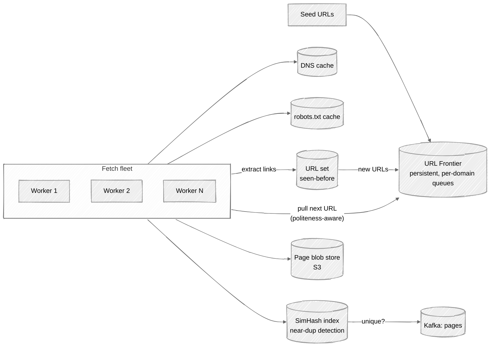
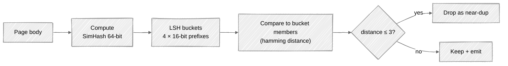

# Week 08: Web Crawler — Walkthrough

> ⏱️ **Time budget:** 45 minutes
> 🎯 **Goal:** Design the URL frontier, fetch fleet, and dedup pipeline; defend politeness.

---

## 1. Clarify scope (5 min)

- "Are we crawling general web (high-variance domains) or a specific corpus (e.g. news only)?"
- "Continuous re-crawl, or one-shot?"
- "Do we follow JavaScript-rendered links (headless browser), or just static HTML?"
- "What does the downstream consumer need — raw HTML, extracted text, or both?"
- "Compliance constraints — robots.txt, GDPR, ToS-aware?"

> 💬 **How to say it:** "Crawlers are a huge problem space. The two big forks are (1) whether we render JavaScript, and (2) whether we re-crawl continuously or one-shot. I want to confirm both before designing."

## 2. Functional requirements

**In scope:**

- Start from seed URLs; follow outbound links
- Fetch HTML; store raw and extracted text
- Respect robots.txt + per-domain politeness (crawl-delay or default ~1 RPS per domain)
- Deduplicate exact-match content; flag near-duplicates
- Resume / restart capability (must survive crashes)

**Out of scope:**

- Continuous re-crawl scheduling (separate concern; we'd design the priority queue for one-shot)
- JavaScript rendering (huge separate problem — headless browser fleet)
- Downstream indexing (we hand off to a Kafka topic or similar)

> 💬 **How to say it:** "Static-HTML crawl, one-shot, polite by default. JavaScript rendering would be a much bigger system."

## 3. Non-functional requirements

| Concern | Target | Why |
|---|---|---|
| Throughput | ~400 pages/sec sustained | 1B pages / 30 days |
| Politeness | ≤ 1 RPS per domain by default; honor robots.txt crawl-delay | Real-world rule of the road |
| Failure tolerance | Resume from crash without losing the frontier | 30-day jobs *will* crash |
| Dedup precision | Drop ≥95% of duplicates | Saves storage and downstream work |
| Storage | ~5 TB raw HTML (compressed) | Per problem |

## 4. Back-of-envelope estimation

| Quantity | Value | Working |
|---|---|---|
| Pages/sec target | ~400 | 1B / 30 / 86,400 |
| Avg page size | ~100 KB raw / ~25 KB compressed | Typical |
| Bandwidth in | ~40 MB/s | 400 × 100 KB |
| Storage | ~5 TB compressed | Per problem |
| Frontier size (peak) | ~500M URLs | URLs queued but not yet fetched |
| Per-URL state | ~200 B | URL + metadata |
| Frontier memory | ~100 GB | 500M × 200 B; needs spill-to-disk |
| Unique domains | ~10M | Long tail |

**Insight:** the URL frontier is the most interesting data structure in this problem. It's huge, has to be persistent (survive crashes), and has to support per-domain ordering for politeness.

> 💬 **How to say it:** "The frontier dominates the design. It's 100 GB+ of state, has to be persistent, and has to enforce per-domain politeness. Everything else is fetch-and-write."

## 5. API design

This is mostly an internal system with no client-facing API. The interesting interfaces are:

```
Frontier:
  add_urls(urls: list[URL], priority: int)
  next() -> URL                # respects politeness
  mark_done(url, result)       # success/failure for retry tracking

Downstream output:
  Kafka topic: pages
  message: { url, fetched_at, status, content_blob_key, links_extracted }
```

> 💬 **How to say it:** "No external API — output is a stream of fetched pages on a Kafka topic. The frontier is the internal interface; everything else hangs off it."

## 6. High-level architecture



The frontier is the centerpiece. Workers pull from it (respecting politeness), fetch, write blob + emit downstream event, extract links, deduplicate URLs, push new URLs back.

> 💬 **How to say it:** "Three layers: the frontier (state), the fetch fleet (action), and the dedup/output pipeline. Politeness is enforced in the frontier — workers can only get URLs they're allowed to fetch right now."

## 7. The URL frontier — deep design

```
Frontier
├─ Front queue       (by priority)
├─ Per-domain queues (one per domain)
└─ Politeness clock  (when can each domain next be fetched)
```

When a worker asks for the next URL:

1. Pull from a per-domain queue whose **next-fetch time** ≤ now.
2. Move the domain's next-fetch time forward (by `max(1s, robots.crawl-delay)`).
3. Return the URL to the worker.

This is **Mercator-style** (the classic crawler design).

**Implementation:**

- **Back-end storage:** RocksDB / a partitioned SQL table for persistence (must survive worker crashes).
- **Index:** Redis sorted set keyed by domain, score = next-fetch-time. Cheap to find "what domains can I fetch right now."

```
ZADD politeness {next_fetch_time} {domain}
ZRANGEBYSCORE politeness 0 {now} → ready domains
```

> 💬 **How to say it:** "Two structures — persistent per-domain queues on disk, a Redis sorted set keyed by domain on next-fetch-time for the politeness scheduler. Workers query Redis to find ready domains, then pull URLs from that domain's queue."

## 8. Deep dive: deduplication

Two layers of dedup:

### URL-level (have we seen this URL before?)

```
URL set: 1B URLs × ~50 B average → 50 GB
```

A Bloom filter is the classic answer here — false positives are acceptable (we lose a duplicate, no harm), and 50 GB → ~10 GB Bloom with 1% false-positive rate.

> 💬 **How to say it:** "URL dedup is a Bloom filter — 10 GB instead of 50 GB, and a false positive just means we skip a URL we technically haven't seen. False negatives are zero. Perfect tradeoff for this use case."

### Content-level (is this a near-duplicate of an existing page?)

The web is full of mirrors, AdSense pages, "powered by WordPress" boilerplate. Naive hash dedup catches only exact bytes. For near-duplicates we need **SimHash** or **shingling**:

| Technique | How |
|---|---|
| **MD5 of body** | Catches exact dupes only |
| **Shingling** | Compute set of 5-word shingles; Jaccard similarity |
| **MinHash + LSH** | Approximate Jaccard; sub-linear lookup |
| **SimHash** ✅ | 64-bit fingerprint; Hamming distance ≤ 3 → near-duplicate |

SimHash is what Google has publicly described. 64 bits per page, look up via locality-sensitive hash buckets.



> 💬 **How to say it:** "Two-layer dedup. URL Bloom filter catches re-crawls. SimHash + LSH catches near-duplicate content. SimHash is what Google uses publicly — 64-bit fingerprint, locality-sensitive hashing lets you find candidates in sub-linear time."

## 9. Bottlenecks + scaling

| Component | Hot spot | Mitigation |
|---|---|---|
| Per-domain politeness | One slow domain blocks no other; politeness is per-domain | Already isolated; nothing to do |
| DNS lookup | Major bottleneck if not cached | Aggressive DNS cache; one record per domain for the whole crawl |
| Bandwidth | 40 MB/s average | Distribute fetch fleet across regions |
| Frontier reads | High write rate (millions of new URLs per minute) | Partition the frontier; sharded RocksDB |
| Storage write rate | 400 pages/sec × 25 KB compressed | S3 handles trivially |
| Spam traps | Pages with infinite outbound links | Per-domain crawl cap; depth limit; outbound-link rate limit |

**The non-obvious failure mode:** *spider traps*. A page that links to itself with a different query string can keep a crawler busy forever. Mitigations:

- Per-domain crawl cap (e.g., max 100k pages per domain).
- URL canonicalization (drop tracking params, sort query strings, lowercase).
- Outbound-link sanity check (if a domain emits 10× the average outbound links per page, flag it).

> 💬 **How to say it:** "The frontier scales linearly with sharding. The interesting failure mode is spider traps — sites that generate infinite URLs. Mitigation is per-domain caps plus URL canonicalization."

## 10. Tradeoffs + what you'd change

**What I picked:**

- Mercator-style frontier with per-domain queues + politeness clock
- Bloom filter for URL dedup
- SimHash + LSH for content dedup
- One-shot crawl (no continuous scheduling)
- Kafka as the downstream output

**What I chose against:**

- Single global queue (would serialize politeness; no per-domain parallelism)
- Exact dedup only (misses ~30% of duplicates that are minor variations)
- Synchronous downstream (would tie crawler progress to consumer health)
- Per-page TLS reconnect (use connection pooling per domain)

**Given more time, I'd dig into:**

- Continuous re-crawl: priority queue weighted by page change frequency
- Headless browser fleet for JavaScript-heavy sites
- Politeness diplomacy (rotating user-agents, contact email in user-agent string)
- Distributed coordination of the frontier (Zookeeper / Raft) if we shard it
- Cost-aware crawl (don't crawl 1M pages on a site that returns the same 100 pages with different params)

> 💬 **How to say it:** "Those are the calls. The most interesting follow-up is continuous re-crawl scheduling — that's a different beast where you're trading freshness against politeness against cost."

---

## Common pitfalls

- **One global FIFO queue.** No per-domain politeness; you'll get banned.
- **Skipping the dedup conversation.** Web is 30-50% duplicates.
- **Storing every URL in a hash set.** 50 GB; should be a Bloom filter.
- **Ignoring DNS.** It's the surprise bottleneck of every real crawler.
- **No persistence on the frontier.** Workers crash; jobs that run for 30 days *will* lose hours of work.

See [interviewer-cues.md](interviewer-cues.md).
