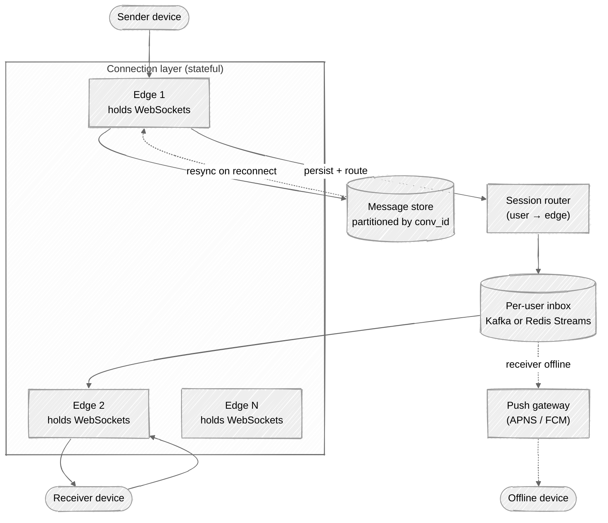
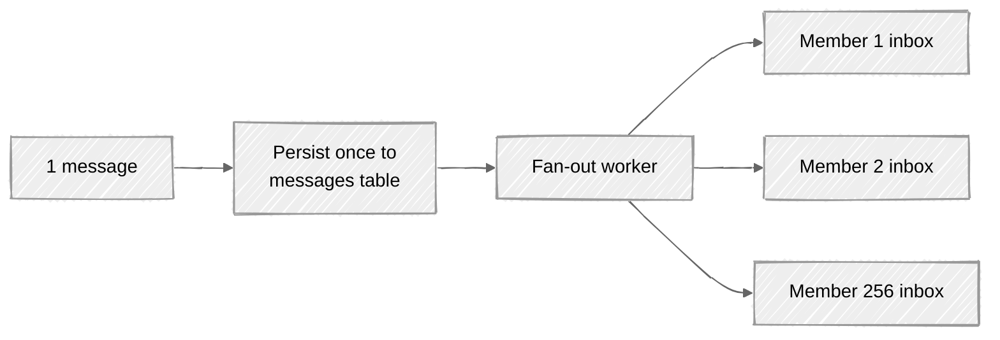

# Week 09: Chat System — Walkthrough

> ⏱️ **Time budget:** 45 minutes
> 🎯 **Goal:** Land on WebSocket connection layer + per-conversation ordering + push-on-offline; defend the group fan-out story.

---

## 1. Clarify scope (5 min)

- "1:1 only, or also group chat? If group, what's the max size?"
- "Are messages text-only, or media too (images, voice)?"
- "End-to-end encryption — required, or out of scope?"
- "Read receipts, typing indicators, delivery receipts — which?"
- "How long do we keep history — forever, or N days?"

> 💬 **How to say it:** "Chat is a deceptively large surface. The two biggest design forks are group size and E2E encryption — both materially change the architecture."

## 2. Functional requirements

**In scope:**

- Send/receive 1:1 messages
- Group chat up to 256 members
- Delivery receipts (sent, delivered, read)
- Offline storage and resync
- Push notifications when client is offline

**Out of scope:**

- E2E encryption (acknowledged; would use Signal protocol)
- Voice/video calls (separate WebRTC system)
- Media attachments (separate upload pipeline; chat carries a URL/blob ref)
- Multi-device sync (acknowledged; key idea is per-device offline queue)

> 💬 **How to say it:** "Text + light metadata. E2E and media are real concerns but they're additive — I'll design the core message-delivery system and call out where they'd plug in."

## 3. Non-functional requirements

| Concern | Target | Why |
|---|---|---|
| Delivery latency (online) | p99 < 100ms within region | Real-time feel |
| Message durability | 99.999999999% | Losing a chat message is catastrophic |
| Availability | 99.95% | Customer-facing |
| Ordering | Per-conversation total order | Within a conversation, no reordering |
| Offline delivery | Within seconds of reconnect | Resync is the cold-start path |
| Scale | 500M DAU, ~30k msg/sec sustained | Per problem |

> 💬 **How to say it:** "The non-negotiable is per-conversation ordering — within a thread, no reordering. Global ordering across conversations isn't needed, which is what makes this tractable at scale."

## 4. Back-of-envelope estimation

| Quantity | Value | Working |
|---|---|---|
| Messages/sec (avg) | ~290k | 500M × 50 / 86,400 |
| Messages/sec (peak) | ~3M | 10× spike (holidays, evenings) |
| Avg message size | ~100 B | Text |
| Daily message volume | 25B msgs | 500M × 50 |
| Daily storage growth | ~2.5 TB | 25B × 100 B |
| 30-day retention | ~75 TB | Easy on a sharded DB |
| Concurrent open WebSocket connections | ~50M | 10% of DAU online at any moment |

**Insight:** the dominant cost isn't message volume — it's the **50 million long-lived WebSocket connections.** That requires a connection-layer fleet sized for connections, not for QPS.

> 💬 **How to say it:** "The interesting scaling number isn't messages per second — it's open WebSocket connections. 50 million concurrent. That dictates the fleet topology."

## 5. API design

```
WebSocket /v1/connect
  ← server: { user_id, session_id, last_seq_seen }
  → client/server frames:
    { type: "send", to: user_or_group_id, body: "...", client_id: "<uuid>" }
    { type: "ack",  seq: 12345 }
    { type: "deliver", from: u, conv: c, seq: 12345, body: "..." }
    { type: "read", conv: c, up_to_seq: 12340 }
    { type: "typing", conv: c, is_typing: true }
```

`client_id` is the idempotency key — the server dedups by it so retries are safe.

Fallback HTTP REST endpoints for cases where WebSocket can't establish:

```
POST /v1/messages  (HTTP fallback)
GET  /v1/conversations/{id}/messages?after_seq=12340
```

> 💬 **How to say it:** "WebSocket is the primary transport; HTTP REST is the fallback for restrictive networks. The client_id field is the idempotency key — clients retry safely without duplicate messages."

## 6. High-level architecture



Three roles:

- **Edge** — holds the WebSocket; per-user routing; stateful (so users connect to a specific edge box).
- **Router** — looks up "which edge is this user on?" via a Redis directory.
- **Inbox queue** — per-user durable queue so a fan-out write can wait for the recipient.

> 💬 **How to say it:** "Edge nodes hold the stateful WebSockets. When a message arrives, the edge persists it to durable storage and pushes it to the recipient's inbox queue. If the recipient is online, the queue drains into their edge connection within milliseconds. If they're offline, the queue holds the message and triggers a push notification."

## 7. Data model

```
messages (sharded by conversation_id)
─────────────────────────────────────────────
message_id     BIGINT  (Snowflake; time-sortable)
conv_id        BIGINT
sender_id      BIGINT
seq            BIGINT  (per-conversation sequence)
client_id      VARCHAR(36)  (idempotency key)
body           TEXT
sent_at        TIMESTAMP
─────────────────────────────────────────────
PK (conv_id, seq)
UNIQUE (conv_id, client_id)   -- dedup on retry

conversations
─────────────────────────────────────────────
conv_id        BIGINT PK
kind           ENUM (one_to_one, group)
members        BIGINT[]      -- denormalized for fast lookup
last_seq       BIGINT
created_at     TIMESTAMP

membership (sharded by user_id)  -- for "which convs does this user belong to?"
─────────────────────────────────────────────
user_id        BIGINT
conv_id        BIGINT
last_read_seq  BIGINT
muted          BOOLEAN
joined_at      TIMESTAMP
PK (user_id, conv_id)
```

Per-conversation `seq` is the key to ordering. Each new message gets `seq = MAX(seq) + 1` within a conversation. Clients track `last_seq_seen` and request `after_seq` to resync.

> 💬 **How to say it:** "Sharding is by conversation_id — messages in the same conversation co-locate, which makes the per-conversation sequence cheap to maintain. Membership is sharded by user_id, since the common access pattern is 'find all my conversations.'"

## 8. Deep dive: group fan-out and offline delivery

### Group fan-out

For a group of 256 members, when one sends a message:

1. Persist the message once (the `messages` row).
2. Look up the member list (`conv.members`).
3. For each online member, push to their edge.
4. For each offline member, leave the message in their inbox queue + emit a push.

Notice: **the message is stored once, fanned out to 256 inbox queues.** This is "fan-out on write" — same idea as the news feed problem, but the fan-out factor (256) is small, so we don't need celebrity logic.



> 💬 **How to say it:** "Group fan-out is bounded at 256 — small enough that we don't need celebrity logic. Each member has their own inbox queue; the fan-out worker is just a loop pushing to each."

### Offline delivery — the resync flow

When a user reconnects:

1. Edge accepts the WebSocket, authenticates.
2. Client sends `last_seq_seen` per conversation.
3. Edge queries `messages WHERE conv_id IN (user's convs) AND seq > last_seq_seen ORDER BY seq`.
4. Streams the missed messages.
5. Marks user's inbox queue as drained.

The inbox queue itself is bounded — we don't keep weeks of messages in Redis. The `messages` table is the source of truth; the queue is just a notification mechanism for "you have new mail."

> 💬 **How to say it:** "Resync is database-driven, not queue-driven. The inbox queue is a *notification* that you have messages; the source of truth is the messages table. The client tells us 'I last saw seq 12340,' and we stream everything above that."

### Read receipts

A read receipt is just another message-like event:

```
client → "I've read up to seq 12340 in conv 999"
server → updates membership.last_read_seq for that user
server → broadcasts a "read" event to other group members
```

For groups, this can be heavy (250 read receipts per popular message). Solutions: only broadcast read receipts for 1:1; for groups, only track aggregate "how many members have read."

## 9. Bottlenecks + scaling

| Component | Hot spot | Mitigation |
|---|---|---|
| Edge connections | 50M concurrent | Sharded edge fleet; session router maps user → edge |
| Routing lookups | Every message: "where is the recipient?" | Redis directory (`user → edge_id`); cached at sender's edge for active conversations |
| Database writes | 290k–3M msg/sec | Sharded by conv_id; SSDs and modest hardware can hit 10k writes/sec/shard |
| Inbox queues | 50M Kafka partitions is too many | Bucket users into N partitions (e.g., 10k partitions covering 50M users) |
| Push gateway | Bursts on group messages | Rate-limit per device; coalesce notifications |
| Reconnect storm | Power outage in a region → millions reconnect at once | Exponential backoff on client; load-shedding at edge |

**The non-obvious one: reconnect storm.** If a region goes down and comes back, every client reconnects at once. Without backoff, the edge fleet melts. Mitigation: clients use exponential backoff; edges accept connections with a probabilistic load-shed during recovery.

> 💬 **How to say it:** "The interesting failure mode isn't steady-state load — it's recovery. When a region recovers, millions reconnect simultaneously. Client-side backoff + server-side probabilistic admission control prevents thundering herd."

## 10. Tradeoffs + what you'd change

**What I picked:**

- WebSocket primary transport, HTTP fallback
- Stateful edge with session router
- Per-conversation sequence numbers for ordering
- Persistent inbox queues per user
- Fan-out on write for group messages

**What I chose against:**

- HTTP long-polling primary (works but more battery on mobile)
- Centralized message log (single sequence number across all conversations doesn't scale)
- Pure pull architecture (would mean every client polls, killing scale)
- E2E encryption in scope (huge separate design)

**Given more time, I'd dig into:**

- E2E (Signal protocol — Double Ratchet, X3DH key exchange)
- Multi-device sync (each device gets its own inbox)
- Media attachments (separate upload pipeline; messages carry refs)
- Backup and restore (encrypted backup to user's cloud)
- Anti-spam / abuse infrastructure

> 💬 **How to say it:** "Those are the calls. The most interesting follow-up is multi-device — at this scale every user has 2-3 devices, and you have to think about per-device inbox queues, message acknowledgments per device, and 'mark as read' propagation across them."

---

## Common pitfalls

- **Designing it like REST.** Long-poll-based chat has terrible mobile UX.
- **One global message log.** Doesn't scale; per-conversation is the right shard key.
- **Forgetting reconnect storms.** Recovery is harder than steady-state.
- **No idempotency key.** Retries create duplicates.
- **Fan-out without bound.** Group size has to be capped or you get news-feed-scale problems.

See [interviewer-cues.md](interviewer-cues.md).
