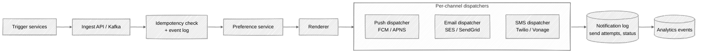
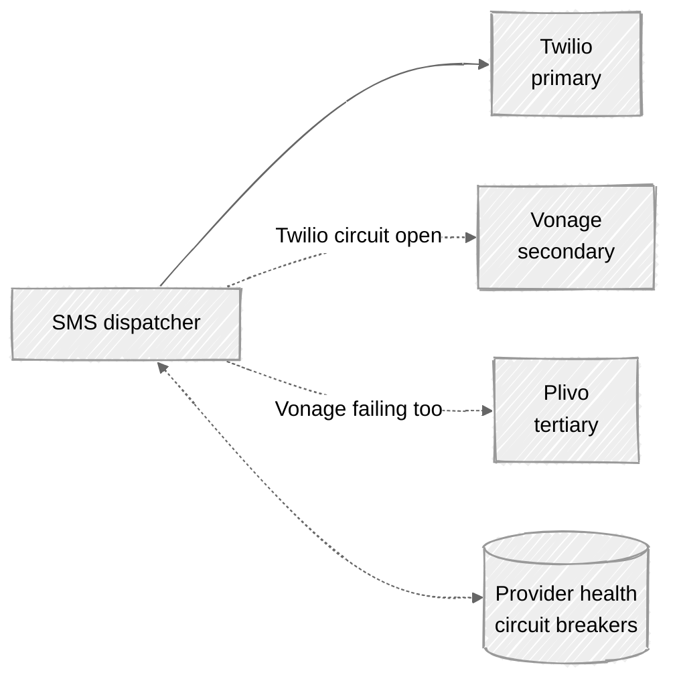

# Week 10: Notification System — Walkthrough

> ⏱️ **Time budget:** 45 minutes
> 🎯 **Goal:** Land on the pipeline shape (trigger → preferences → render → dispatch), then defend idempotency and provider failover.

---

## 1. Clarify scope (5 min)

- "Who triggers a notification — internal services, or also external partners?"
- "Are notifications transactional (you got a message, your order shipped) or marketing (promotional)?"
- "Do we need to schedule notifications for the future, or fire-and-forget on event?"
- "Per-user preferences — are they per-channel, per-category, or both?"
- "What's the SLA on delivery — seconds, minutes?"

> 💬 **How to say it:** "Notifications cover everything from 2FA codes (must arrive in seconds) to marketing emails (acceptable to delay days). The product mix changes the design significantly."

## 2. Functional requirements

**In scope:**

- Receive notification trigger events (via API or Kafka)
- Apply per-user preferences (channel, quiet hours, opt-outs)
- Render content per channel (push payload, email HTML, SMS text)
- Dispatch to provider (FCM, APNS, SES, Twilio, etc.)
- Deduplicate: same `(user, event_id)` sends once
- Provider failover

**Out of scope:**

- The trigger sources themselves (we accept events; we don't generate them)
- Marketing campaign management (audience targeting, A/B tests)
- Content authoring tools
- Analytics dashboard (we emit events; someone else consumes them)

> 💬 **How to say it:** "Transactional notifications first — the marketing layer would sit on top of this and add audience targeting + scheduling. Different problem."

## 3. Non-functional requirements

| Concern | Target | Why |
|---|---|---|
| Delivery latency (transactional) | < 5s p99 | 2FA / OTP needs to be fast |
| Throughput | ~1.2k notifications/sec avg, 10k+ peak | 100M/day |
| Duplicate rate | < 0.01% | Critical for trust |
| Provider failover | Within seconds when primary fails | SMS in particular is flakey |
| Availability | 99.95% | Customer-facing |

## 4. Back-of-envelope estimation

| Quantity | Value | Working |
|---|---|---|
| Notifications/day | 100M | Per problem |
| Notifications/sec (avg) | ~1.2k | 100M / 86,400 |
| Notifications/sec (peak) | ~10k | 10× spike for cron-driven events |
| Per channel | 70M push, 20M email, 10M SMS | Per problem |
| Per-user preference reads | One per notification | Cache aggressively |
| Storage: notifications log (90 days) | ~9B rows, ~2 TB | Sharded |
| Provider failures (peak) | ~1% | Real-world rate |

**Insight:** the workload is modest at steady state. The interesting design lives in **idempotency**, **preferences**, and **provider failover** — not in raw throughput.

> 💬 **How to say it:** "The volume isn't the hard part — 1.2k/sec is trivial. The hard parts are making sure the same event doesn't fire twice, respecting user preferences, and surviving provider outages."

## 5. API design

```
POST /api/v1/notify
Request:
  {
    "event_id": "<uuid>",            // idempotency key
    "user_id": 12345,
    "category": "order_shipped",     // for preference lookup
    "channels": ["push", "email"],   // optional override of preferences
    "data": { "order_id": 999 },     // for templating
    "priority": "transactional"      // transactional | marketing
  }
Response (202):
  { "notification_id": "...", "status": "accepted" }
```

Triggers can also come via Kafka — same payload, no HTTP overhead.

> 💬 **How to say it:** "Two ingress paths — sync HTTP for low-volume callers that want a confirmation, and Kafka for high-volume bulk triggers. Same downstream pipeline."

## 6. High-level architecture



A linear pipeline. Each stage is a stateless service plus the data it needs.

> 💬 **How to say it:** "Pipeline: ingest, dedup, preferences, render, dispatch. Each stage is stateless and horizontally scalable. The state lives in three places — the idempotency log, the preference store, and the per-notification status log."

## 7. Data model

```
notification_events (sharded by event_id)
─────────────────────────────────────────────
event_id        UUID PK         -- idempotency
received_at     TIMESTAMP
trigger_source  VARCHAR
payload         JSON

notifications (sharded by user_id)
─────────────────────────────────────────────
notification_id UUID PK
event_id        UUID            -- back-reference (unique constraint)
user_id         BIGINT
channel         ENUM            -- push | email | sms
status          ENUM            -- pending | sent | delivered | failed
attempts        INT
last_attempt_at TIMESTAMP
provider        VARCHAR         -- which vendor was used
PROVIDER_RESPONSE JSON
─────────────────────────────────────────────
UNIQUE (event_id, channel)      -- the idempotency guard
INDEX (user_id, created_at DESC) -- for "show me my history"

user_preferences (sharded by user_id)
─────────────────────────────────────────────
user_id          BIGINT PK
categories       JSON   -- per-category opts (which channels on for which category)
quiet_hours      JSON   -- per-day start/end in user's timezone
device_tokens    JSON   -- FCM / APNS tokens
email            VARCHAR
phone            VARCHAR
```

The `UNIQUE (event_id, channel)` constraint is what makes the system idempotent at the database level — a duplicate event simply collides.

> 💬 **How to say it:** "Three tables: events (the idempotency log), notifications (per send attempt), and user preferences. The unique constraint on (event_id, channel) is the actual idempotency guarantee — it's enforced by the database, not by a check-then-insert pattern."

## 8. Deep dive: idempotency and provider failover

### Idempotency

Naive approach: "check if event_id has been seen; if not, send."

```python
if not seen(event_id):           # race condition
    send(event_id)
    mark_seen(event_id)
```

Two requests arrive simultaneously, both see "not seen," both send. Classic.

**Correct approach: insert-first, fail-on-conflict.**

```python
try:
    db.insert(notifications, event_id=e, channel=c)   # unique constraint
except UniqueViolation:
    return "already sent"                              # short-circuit; second caller does nothing
send_to_provider(e)
mark_status(sent)
```

The database is the synchronization point. Even if 100 callers race, only one succeeds the insert; the rest get a unique-constraint violation and back off.

> 💬 **How to say it:** "Idempotency is enforced by the database, not by application code. The insert into the notifications table has a unique constraint on (event_id, channel). Whoever wins the insert gets to send. Everyone else short-circuits. No race condition."

### Provider failover

Each channel has multiple providers. The dispatcher tries them in a configurable order with circuit breakers.



A circuit breaker tracks per-provider failure rate over a sliding window. Above threshold, the breaker opens; traffic routes to the next provider; periodic probes test if the original recovered.

> 💬 **How to say it:** "Circuit breakers per provider. If Twilio fails 10% over the last minute, the breaker opens and we route to Vonage. Periodic half-open probes test if Twilio's back. This is critical for SMS in particular — carriers have regional outages constantly."

### Retries

Failed sends are retried with exponential backoff, up to a cap (typically 3-5 attempts over an hour). After the cap, the notification is marked `failed` and emitted as an analytics event (for downstream alerting).

```
attempts:  1     2      3       4       5
backoff:   30s   2m    10m     30m    1h    → mark failed
```

> 💬 **How to say it:** "Exponential backoff with a cap. After 5 attempts spread over an hour, we give up and emit a `notification_failed` event for ops to triage. Transactional notifications might have a much shorter retry budget — a 2FA code that arrives 30 minutes later is useless."

## 9. Bottlenecks + scaling

| Component | Hot spot | Mitigation |
|---|---|---|
| Preference store | Read on every notification | Cache aggressively (Redis, 5-min TTL); preferences change rarely |
| Idempotency check | One unique-index lookup per notification | Already a database operation; partition by event_id |
| Dispatcher → provider | Per-provider rate limits (FCM 600 req/sec/project, etc.) | Per-provider token bucket; queue and smooth |
| Quiet hours | "Defer until 8am in user's timezone" | Scheduled queue (Redis sorted set by deliver_at) |
| Email rendering | Templates can be expensive | Cache compiled templates; pre-render where possible |
| Surge of marketing campaign | 10M notifications dropped at once | Marketing has its own throttled lane that can't starve transactional |

**The non-obvious one:** *priority lanes*. A marketing campaign generating 10M notifications must not delay a 2FA code. Separate queues; transactional gets its own dispatcher fleet that's not allowed to fall behind.

> 💬 **How to say it:** "The biggest production failure mode is marketing campaigns starving transactional traffic. Separate Kafka topics, separate dispatcher fleets. Transactional notifications never wait behind a marketing burst."

## 10. Tradeoffs + what you'd change

**What I picked:**

- Pipeline architecture with stateless stages
- Idempotency via database unique constraint (not application-level check)
- Per-provider circuit breakers and failover
- Separate transactional vs. marketing priority lanes
- Aggressive preference caching

**What I chose against:**

- Application-level idempotency check (race condition)
- Single provider per channel (no failover)
- Synchronous trigger → send (would couple latency budgets)
- Sending without a preference lookup (regulatory issue with marketing)

**Given more time, I'd dig into:**

- Cross-channel coordination (don't send the same message via push AND email AND SMS)
- Aggregation ("Sam liked your post" coalesces into "Sam and 3 others liked your post")
- Engagement-aware throttling (stop sending to users who never open)
- Compliance: GDPR opt-out propagation, unsubscribe headers
- A/B-test framework for content variants

> 💬 **How to say it:** "Those are the calls. The most interesting follow-up is cross-channel coordination — you don't want to send the same alert via push, email, and SMS within a minute. Suppression rules across channels add a layer to the pipeline."

---

## Common pitfalls

- **Application-level idempotency.** Race conditions. Use the database.
- **One provider per channel.** Real-world providers go down constantly.
- **No marketing vs. transactional separation.** Marketing surges starve everything else.
- **Synchronous send in the trigger API.** Couples latency budgets; one slow provider stalls callers.
- **Treating quiet hours as a global feature.** They're per-user, in the user's timezone.

See [interviewer-cues.md](interviewer-cues.md).
