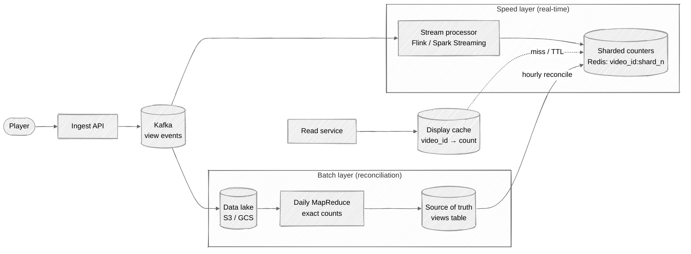
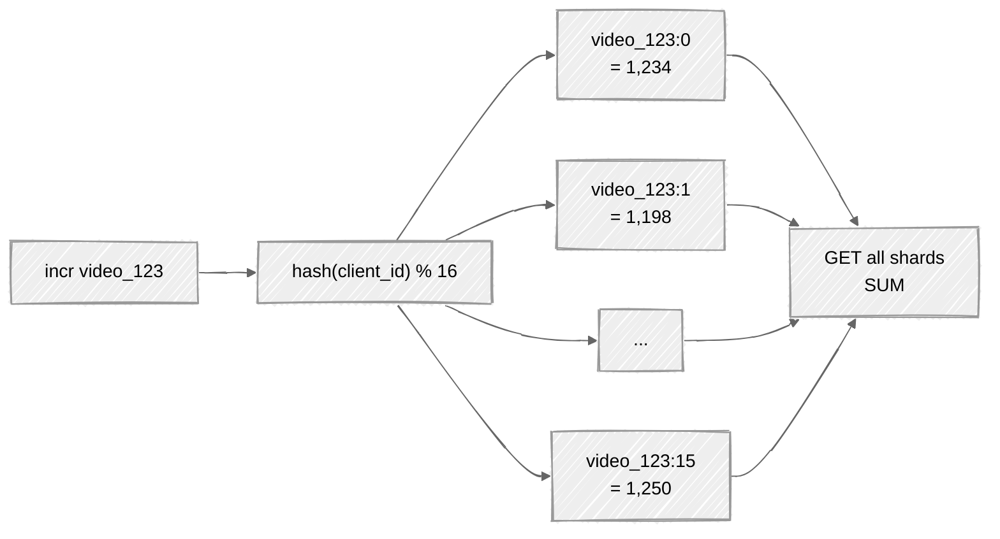

# Week 11: Distributed Counter — Walkthrough

> ⏱️ **Time budget:** 45 minutes
> 🎯 **Goal:** Sharded counter + lambda-style aggregation; defend the accuracy/cost tradeoff.

---

## 1. Clarify scope (5 min)

- "Do views need to be exact, or approximately accurate (e.g. within 1%)?"
- "Are we deduplicating views per user, or counting raw events?"
- "Does the displayed counter need to be real-time, or 1-minute stale OK?"
- "Do we count anonymous views (no user_id)?"
- "Bot detection — in scope, or handled upstream?"

> 💬 **How to say it:** "The single biggest design fork is exact vs. approximate counting. YouTube famously rounds high-view counts because they can't justify exact at that scale."

## 2. Functional requirements

**In scope:**

- Increment a view counter when a user watches a video (some watch-threshold elapsed)
- Display the current counter on the video page
- Counts must be "approximately accurate" — within ~1% for hot videos
- < 1s display freshness target

**Out of scope:**

- Bot/fraud detection (separate pipeline emits cleaned event stream)
- Per-user view history (different store; we just count)
- Cross-video aggregates (channel total views, etc.)
- Revenue calculations (those want exact; different SLA; offline)

> 💬 **How to say it:** "Approximate counting with eventual consistency. Exact counting would be much more expensive and isn't what the product requires for the display."

## 3. Non-functional requirements

| Concern | Target | Why |
|---|---|---|
| Display latency | < 1s stale | Per problem |
| Display read latency | < 100ms p99 | Page-load critical |
| Write throughput | ~580k events/sec avg, 10M peak | 50B/day, spikes for viral content |
| Accuracy | Within 1% for hot videos; exact for the long tail | Cost-aware |
| Availability | 99.99% | Counter showing 0 is a visible bug |

## 4. Back-of-envelope estimation

| Quantity | Value | Working |
|---|---|---|
| View events/sec (avg) | ~580k | 50B / 86,400 |
| View events/sec (peak) | ~5M | 10× for global events |
| Hot video peak | ~10M/hr / video → ~3k/sec on one video | Per problem |
| Videos | 5B | Per problem |
| Reads (page loads)/sec | ~50M | Far more than writes |
| Counter row size | ~16 B (video_id, count) | Trivial |
| Total counter storage | ~80 GB | Tiny |
| Aggregation lag (target) | Sub-second for hot, minute for cold | Hot needs fast pipeline |

**Insight:** the hard problem isn't storage — it's the **5M+ writes/sec peak with hot keys getting 3k writes/sec to a single counter.** A naive `UPDATE counter SET count = count + 1` will lock that row 3000 times per second.

> 💬 **How to say it:** "Capacity and storage are easy. The interesting constraint is hot keys — one viral video at 3k writes/sec collides on the same counter row. That's where you need to shard the counter itself."

## 5. API design

```
POST /v1/views                  // ingest from client / playback service
  { video_id, user_id?, session_id, watched_seconds, country }

GET  /v1/videos/{id}/views      // read for display
  → { count: 12_345_678, fetched_at: "..." }
```

Reads are obviously cacheable; writes go to a queue.

> 💬 **How to say it:** "Two endpoints: write (event ingestion, fire-and-forget), read (counter display, heavily cached). Writes don't return the new count synchronously — they're best-effort."

## 6. High-level architecture — lambda style



**Two layers:**

- **Speed layer:** stream processing aggregates events into sharded Redis counters in seconds.
- **Batch layer:** daily/hourly MapReduce computes exact counts from the data lake and reconciles back into Redis.

The displayed count is approximately the speed layer's number; periodically it gets corrected by the batch layer.

> 💬 **How to say it:** "Lambda architecture. Speed layer for real-time approximations, batch layer for exact reconciliation. The display reads from a cache fed by the speed layer; once an hour, the batch layer corrects any drift."

## 7. Deep dive: sharded counters

For a hot video, instead of one row `views[video_123] = N`, we have N rows:

```
views[video_123:0] = a
views[video_123:1] = b
...
views[video_123:15] = p
```

Each incoming event hashes to a random shard. Writes spread across shards, no single row is hot.

**Read** combines all shards:

```python
def get_view_count(video_id):
    total = 0
    for s in range(NUM_SHARDS):
        total += redis.get(f"views:{video_id}:{s}") or 0
    return total
```

For a 16-shard counter, reading is 16 Redis GETs (pipelined: ~1 RTT).



> 💬 **How to say it:** "Each video has N counter shards in Redis. Writes hash to a random shard. Reads pipeline a sum across all N. 16 shards is a typical choice — handles 16× the per-row write rate at the cost of 16 reads per display."

### When to shard? Not all videos need it.

Only top videos have a hot-key problem. For the long tail (the bottom 99% of videos), one row is fine. Hybrid:

| Video tier | Strategy |
|---|---|
| Cold (most videos) | Single counter row |
| Warm (popular) | 4-shard counter |
| Hot (viral) | 16-shard counter |

Tiering happens dynamically — a video crossing a write-rate threshold gets promoted to more shards.

> 💬 **How to say it:** "Tiered sharding. 99% of videos have one counter row. The hot 1% are sharded. A monitoring job promotes videos to more shards as their write rate climbs."

## 8. Deep dive: speed vs. batch reconciliation

The speed layer is approximate by construction:

- Stream processors may double-count on replay.
- Late events might land outside the window.
- Network partitions create gaps.

The batch layer is exact (within data-lake completeness):

- Sources all events from S3 (the durable log).
- Computes per-video counts deterministically.
- Writes corrected values back into the sharded counters.

When values disagree, **batch wins**. The speed layer is replaced, not merged.

```
speed: 12_456_321
batch: 12_457_998 (exact, run over yesterday's logs)
       ↓
display: 12_457_998 (corrected)
       ↓
new events continue increment from the corrected baseline
```

> 💬 **How to say it:** "The speed layer drifts. The batch layer is the source of truth. Every hour or so, batch computes from cold storage and overwrites the speed-layer counters. The display gets corrected without users noticing."

### Approximate uniqueness — HyperLogLog

If "views" means "unique users" not "total events," exact dedup is expensive (need to remember every user_id forever). HyperLogLog approximates unique-count in 12 KB regardless of cardinality.

```
PFADD video_123:hll {user_id}      # constant size
PFCOUNT video_123:hll              # approximate unique
```

> 💬 **How to say it:** "If we need *unique* views (one per user), HyperLogLog gives us approximate unique counts in 12 KB per video — instead of storing a billion user_ids per video. ~1% error, perfect for display."

## 9. Bottlenecks + scaling

| Component | Hot spot | Mitigation |
|---|---|---|
| Hot key in Redis | One viral video at 10M/hr | Shard the counter (above) |
| Kafka partition skew | One video → one partition → backpressure | Hash by `video_id:random` so events spread across partitions |
| Display reads | 50M/sec on hot videos | CDN cache the read endpoint with 1-5s TTL |
| Batch job duration | Reconcile 50B events daily | Spark cluster sized for ~1 hour completion |
| Storage in the data lake | ~5 TB / day | Cheap on S3; tiered to Glacier after 90 days |

**The CDN trick:** the display count itself is the most cacheable read on the entire site. A 1-second TTL still cuts 99% of reads from your service.

> 💬 **How to say it:** "Don't forget the read side — the counter is the most-read piece of data per video page. A 1-second CDN cache absorbs almost all the read traffic without affecting freshness."

## 10. Tradeoffs + what you'd change

**What I picked:**

- Lambda architecture (speed + batch)
- Sharded counters in Redis for hot videos
- Approximate counts with periodic exact reconciliation
- HyperLogLog for unique-user counts (if needed)
- CDN on the read path

**What I chose against:**

- Exact counts at every increment (would require synchronous writes at 5M/sec)
- Kappa (streaming-only) architecture — losing the batch layer means no recovery from bugs in streaming
- Single-shard counter (one viral video kills you)
- Reading the count without caching (50M reads/sec demolishes any backend)

**Given more time, I'd dig into:**

- Watch-time aggregation (sum of seconds watched, not just count of views)
- Per-region counters (most engagement is geo-local; pre-aggregate by region)
- View dedup (counts double-counted at session vs. account level)
- Anti-fraud integration (suppress events tagged as bot traffic)
- Counter rounding for display (YouTube shows "10M views" not "10,234,567 views")

> 💬 **How to say it:** "The most interesting follow-up is watch-time — moving from a count to a *weighted* aggregate (sum of seconds). Same architecture, different aggregation function in the speed layer."

---

## Common pitfalls

- **Single counter row.** Hot keys kill it instantly.
- **Synchronous writes.** Can't do 5M/sec synchronously.
- **No batch reconciliation.** Approximate counts drift forever; you need an exact baseline.
- **Reading uncached.** Display reads dominate; CDN them.
- **Treating exact as the default.** YouTube famously doesn't.

See [interviewer-cues.md](interviewer-cues.md).
