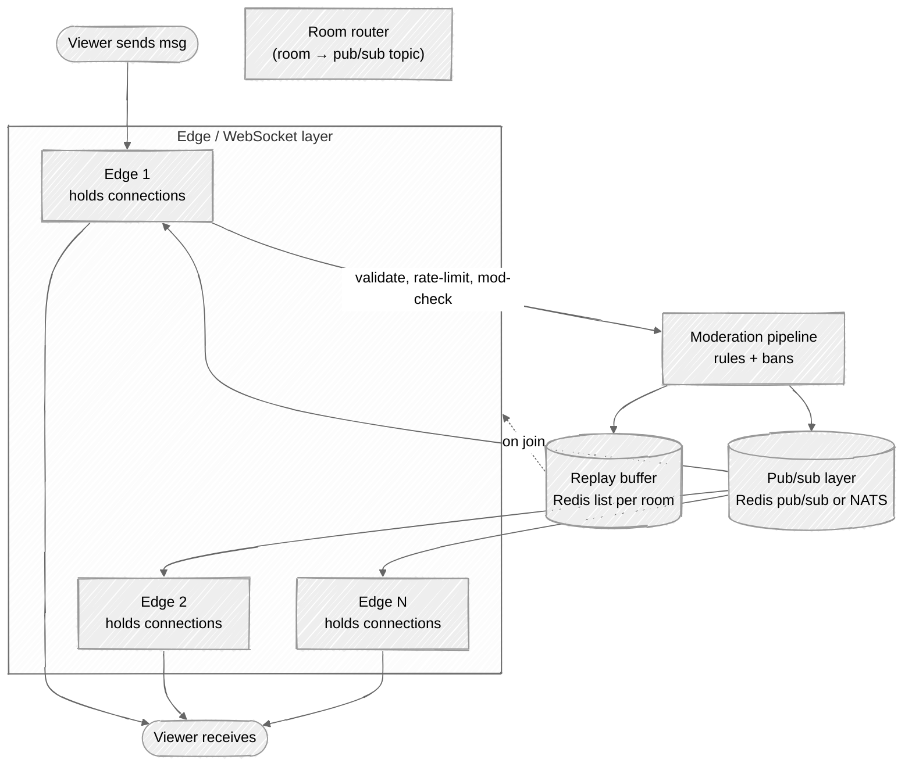
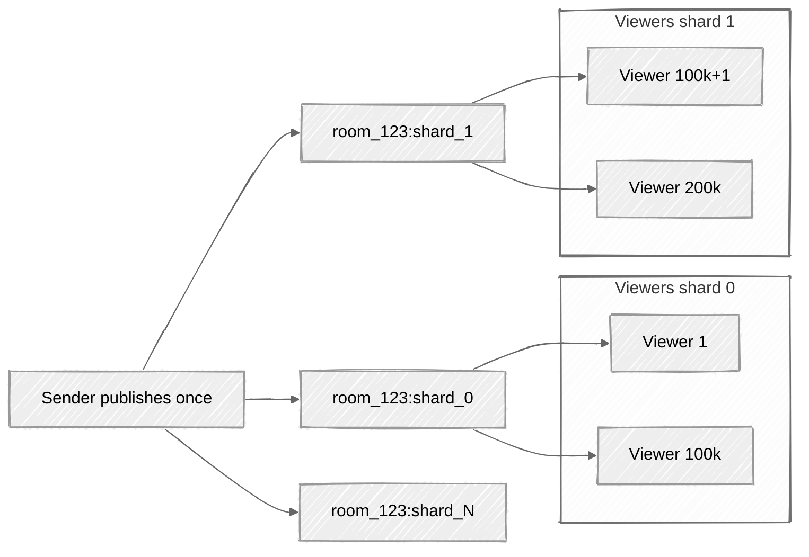
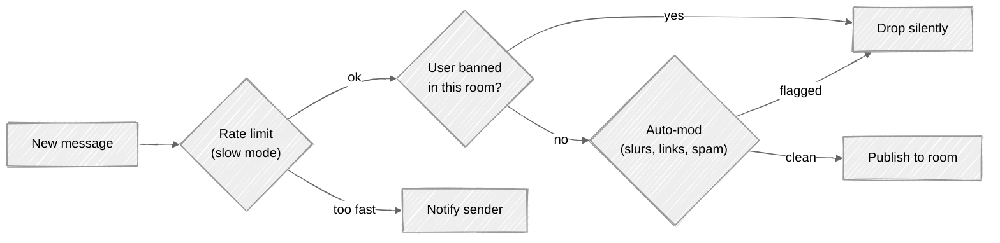

# Week 12: Live Comments — Walkthrough

> ⏱️ **Time budget:** 45 minutes
> 🎯 **Goal:** Defend pub/sub fan-out per room, room sharding for million-viewer streams, and graceful backpressure.

---

## 1. Clarify scope (5 min)

- "Does every viewer see every message, or do we sample / curate for huge streams?"
- "How long is the replay buffer for late joiners — 30 messages? Last 5 minutes?"
- "Are emotes, reactions, polls in scope?"
- "Moderation — automated only, or also human moderators? Per-channel custom rules?"
- "Is chat anonymous, or tied to user identity?"

> 💬 **How to say it:** "Live chat at 1M viewers is *not* the same problem as 1:1 chat. The key difference is that we can't persist every message for every viewer — we have to fan out aggressively and drop the long tail."

## 2. Functional requirements

**In scope:**

- Viewers in a stream see chat in real time
- Replay buffer for late joiners (last ~100 messages or last 5 min)
- Per-stream moderation: bans, slow mode, follower-only mode
- Mass-broadcast: one publisher → all viewers in a room

**Out of scope:**

- DMs and private messages (different system; see Week 09)
- Cross-stream / global moderation tooling
- Polls / interactive features (different surface; shares pub/sub infra)
- Emote rendering (client-side; we just deliver the text)

> 💬 **How to say it:** "One-to-many broadcast within a room. No durable per-viewer history — chat is ephemeral by design at this scale."

## 3. Non-functional requirements

| Concern | Target | Why |
|---|---|---|
| Delivery latency in-room | < 500ms p99 | Conversation requires turnaround |
| Concurrent rooms | 100k | Per problem |
| Max viewers per room | 1M+ | One server can't hold them all |
| Messages per second per room (max) | 1,000+ | Top streams |
| Replay window | ~100 messages or 5 min | Per problem |
| Availability | 99.9% | Chat is non-critical relative to video itself |

## 4. Back-of-envelope estimation

| Quantity | Value | Working |
|---|---|---|
| Total concurrent viewers | ~100M | 100k × 1k avg |
| Concurrent connections (WebSocket) | ~100M | Each viewer one connection |
| Avg messages/sec across all rooms (100% participation) | ~1.7M | 100k rooms × 1k viewers × 1 msg/min ÷ 60 |
| Avg messages/sec across all rooms (realistic, ~10% participate) | ~170k | Most viewers lurk; only a minority chat. Cite this and the 100% bound — interviewer wants both. |
| Peak fan-out in one room | 1M viewers × 1k msg/sec = 1B msgs/sec | Inside one room — undeliverable |
| Replay buffer size per room | 100 × ~100 B = 10 KB | Trivial; Redis list |
| WebSocket connections per server | ~100k | Practical limit |
| Edge servers needed | ~1k | 100M / 100k |

**Insight:** the 1B-messages/sec number is *not* achievable to a single client. We must **slow-mode** or **sample** the message stream at extreme scale. Most production chat does this — at 1M viewers, you don't see every message; you see a sampled subset.

> 💬 **How to say it:** "The math hits a wall at 1M viewers × 1000 msg/sec = 1 billion deliveries per second. We physically can't deliver every message to every viewer in real-time. The product has to define what 'live chat' means at that scale — slow mode, sampling, or a separate VIP tier."

## 5. API design

```
WebSocket /v1/chat/{stream_id}
  ← server: { event: "join", room_id, replay: [last N messages] }
  ↔ frames:
    { type: "send", body: "...", client_id: "<uuid>" }
    { type: "msg", from: user, body: "...", at: ts, msg_id: "..." }
    { type: "mod", action: "ban", user: u }
    { type: "rate_limit", info: "slow_mode 5s" }
    { type: "system", msg: "Stream is in slow mode." }
```

> 💬 **How to say it:** "WebSocket per viewer per room. Authentication and rate limits happen on connect. The send rate is enforced server-side."

## 6. High-level architecture



**Key insight:** edge servers *subscribe* to the pub/sub channel for their room. When a message is published, every edge holding viewers in that room receives it once and fans out to its local connections.

> 💬 **How to say it:** "Edge servers subscribe to per-room pub/sub channels. A message is published once. Each edge that has viewers in that room gets one copy, and fans out to its local WebSocket connections. The pub/sub layer carries one message per room, not per viewer."

## 7. Deep dive: scaling one giant room

Pub/sub works fine until **one room has 1M viewers across 100+ edges**. The single pub/sub topic becomes the bottleneck.

### Shard the room

Split the room's viewers across N "virtual rooms":



Each viewer is assigned to one shard on connect. The publisher writes to all N shards (or to a central distributor that fans out). Now each shard handles 100k viewers — manageable.

**Tradeoff:** the publisher does N writes instead of 1. For 1M viewers split into 10 shards, that's 10 writes per message. Worth it.

> 💬 **How to say it:** "When a single room exceeds what one pub/sub topic can carry, shard the room. Viewers are assigned to a shard on connect. Publishers write to all shards. Each shard handles a tractable subset."

### Backpressure: when the chat outruns viewers' eyeballs

At 1000 msg/sec, no human can read chat. Three options:

| Strategy | How | Tradeoff |
|---|---|---|
| **Slow mode** | Limit each sender to 1 msg / N seconds | Reduces volume at source; viewers see all |
| **Sampling** | Each edge delivers only K% of messages | Viewers see different subsets — controversial but works |
| **Drop tail** | Each edge has a per-viewer buffer; if full, drop new messages | Viewer sees what they can keep up with |

Twitch in practice uses **slow mode** (sender-side throttle) for the worst rooms. Sampling is rarely used because it creates a "missing messages" UX.

> 💬 **How to say it:** "Backpressure has to happen somewhere. Slow mode is the most product-friendly — instead of dropping messages, we throttle who can post. The chat is still readable; the noise floor drops."

## 8. Deep dive: moderation in the hot path

Every message passes through the moderation pipeline before being published. Two layers:



**Latency budget:** moderation must run in < 100ms or the chat doesn't feel live. So:

- Banned-user list: per-room Redis set lookup, O(1).
- Auto-mod: a fast rule-based first pass (regex, blocklist) + an async ML model for borderline cases. Async means the message goes through, but might be retroactively flagged.

> 💬 **How to say it:** "The synchronous moderation budget is tight — ~50ms. Cheap checks happen in line: rate limit, ban list, regex blocklist. ML-based toxicity scoring runs async; if it later flags a message, we issue a retract event to all subscribed edges."

## 9. Bottlenecks + scaling

| Component | Hot spot | Mitigation |
|---|---|---|
| Edge WebSocket density | 100k connections/server | Add edges; geo-distribute |
| Pub/sub for hot rooms | 1M+ viewers on one topic | Shard the room |
| Moderation latency | Synchronous on hot path | Cheap checks inline; expensive checks async |
| Cross-region | Viewers worldwide for one stream | Per-region pub/sub mesh with replication |
| Reconnect storm | Stream goes live → 100k viewers connect in 10s | Connection-rate limit + exponential backoff client-side |

**The non-obvious one: heat-of-the-moment.** A single big moment (sports goal, gaming clutch) generates a chat *spike* — 10× normal rate for 30 seconds. The system needs headroom for these spikes; over-provision edge fleet by ~30%.

> 💬 **How to say it:** "Chat volume isn't uniform — it spikes at exciting moments. Capacity planning isn't 'average viewers × average rate' — it's 'concurrent viewers × peak rate.' Big difference."

## 10. Tradeoffs + what you'd change

**What I picked:**

- Pub/sub fan-out (Redis pub/sub or NATS) with one topic per room
- Edge servers holding WebSockets; subscribe per room
- Room sharding for million-viewer streams
- Slow mode as the primary backpressure mechanism
- Synchronous cheap moderation + async ML

**What I chose against:**

- Per-viewer queue (chat is ephemeral; persisting per viewer doesn't scale)
- One global pub/sub topic (doesn't shard)
- Polling architecture (latency budget unmet)
- Sampling as default backpressure (creates inconsistent UX)
- Persistent chat history (chat is gone the moment the stream ends, by design)

**Given more time, I'd dig into:**

- Replay buffer mechanics (Redis sorted set per room, capped)
- Subscriber moderation tooling (chat mods at scale, real-time)
- Cross-region delivery for global streams
- Polls and interactive features that share the same pub/sub
- VIP / subscriber chat (separate channel for paid users with relaxed rate limits)

> 💬 **How to say it:** "Those are the calls. The most interesting follow-up is the cross-region story — a global stream has viewers in every region, but the pub/sub mesh isn't naturally multi-region. Replicating across regions adds ~100ms of latency. Usually we accept it; the alternative is per-region rooms which split the conversation."

---

## Common pitfalls

- **Treating this like 1:1 chat.** Persistence model is totally different.
- **One pub/sub topic per viewer.** Doesn't scale.
- **No room sharding.** One viral stream takes down the platform.
- **Synchronous ML moderation.** Adds seconds to the hot path.
- **No backpressure plan.** "We'll just scale" doesn't work when delivery is fundamentally O(viewers × messages).

See [interviewer-cues.md](interviewer-cues.md).
