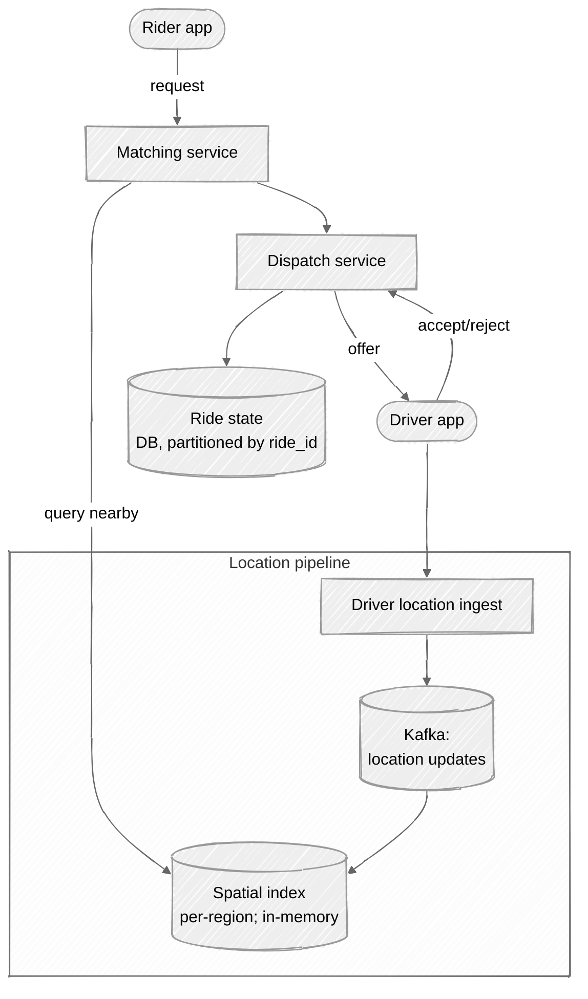
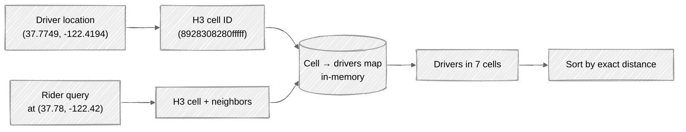
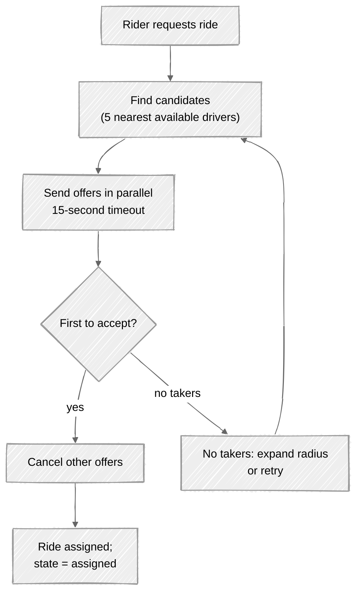

# Week 13: Ride-Sharing — Walkthrough

> ⏱️ **Time budget:** 45 minutes
> 🎯 **Goal:** Geospatial index (geohash or S2) + matching service + ride lifecycle as a state machine.

---

## 1. Clarify scope (5 min)

- "Are we designing rider matching only, or also pricing, payments, and surge?"
- "Single ride at a time per driver, or pooled rides (UberPool)?"
- "Do we factor in driver rating, vehicle type, accessibility?"
- "Real-time during the ride — turn-by-turn navigation, or just dispatch?"
- "Cancellation handling — who can cancel, when, fees?"

> 💬 **How to say it:** "Uber is huge in scope — payments, navigation, pricing, surge, pooling. I'll focus on the core matching + dispatch problem, and call out where the other systems plug in."

## 2. Functional requirements

**In scope:**

- Riders request a ride (pickup + dropoff location)
- System finds N nearest available drivers, offers ride
- First driver to accept wins; others remain available
- Driver location updates streamed to backend (every 4s)
- Ride state machine: requested → assigned → en_route → arrived → in_progress → completed
- Cancellation handling

**Out of scope:**

- Payments and pricing (referenced; would be a downstream system on `ride_completed` event)
- Surge pricing (separate service that adjusts price multiplier per geohash cell)
- Turn-by-turn nav (clients use a maps SDK)
- UberPool (different matching algorithm; reuses this infra)
- Driver onboarding, identity

> 💬 **How to say it:** "Rider-to-driver matching + the ride state machine. Payments, navigation, and pricing all hang off events we emit."

## 3. Non-functional requirements

| Concern | Target | Why |
|---|---|---|
| Match latency | < 5s p99 | User experience |
| Location update throughput | ~1.25M updates/sec | 5M drivers × every 4s |
| Geo-query latency | < 200ms p99 | Must complete fast for the matching SLA |
| Availability | 99.99% | Service-critical |
| Consistency | Eventual on location; transactional on assignment | Two riders shouldn't get the same driver |

## 4. Back-of-envelope estimation

| Quantity | Value | Working |
|---|---|---|
| Driver location updates/sec | ~1.25M | 5M × 1/4s |
| Ride requests/sec (avg) | ~230 | 20M / 86,400 |
| Ride requests/sec (peak) | ~5,000 | 20× spike (rush hour) |
| Active rides at peak | ~500k | Average ride is 20 min |
| Driver location DB size | ~80 GB | 5M × ~100 B + index |
| Region count | ~10k | Each handles a city-scale slice |
| Avg geo-query result | ~50 candidates | 5 mile radius in dense urban area |

**Insight:** the location-update fire-hose (1.25M/sec) is the throughput challenge. The matching itself is rare (5k/sec) but latency-sensitive.

> 💬 **How to say it:** "Two very different workloads collide here: a constant 1.25M location updates per second, and a much rarer but latency-critical matching workload. They want different data structures."

## 5. API design

```
// Rider
POST /v1/rides
  { pickup: {lat, lng}, dropoff: {lat, lng}, vehicle_type: "uberx" }
  → { ride_id, estimated_pickup_time, fare_estimate }

// Driver (long-lived connection or polling)
WebSocket /v1/driver/{id}
  ← server: { event: "offer", ride_id, pickup, fare, expires_at }
  → driver: { type: "accept", ride_id }
                | { type: "reject", ride_id }
                | { type: "location", lat, lng, heading }
                | { type: "status", state: "arrived" }

GET /v1/rides/{id}    // status polling for rider
```

Location updates from drivers come over the long-lived connection (not REST POST per update — would explode latency and battery).

> 💬 **How to say it:** "WebSocket from driver app for both location stream and ride offers. REST for riders since they're not high-frequency. The driver connection is bidirectional — they send location, they receive offers."

## 6. High-level architecture



The spatial index is **in-memory per region**, fed continuously by the location stream.

> 💬 **How to say it:** "Spatial index lives in memory, per region. It's the hot data structure — updated by 1.25M location events per second and queried by the matching service. Persistence is in Kafka; the in-memory index is reconstructible."

## 7. Deep dive: geospatial indexing

A `WHERE ST_DWithin(...)` SQL query against 5M drivers doesn't hit the 200ms budget. The classic answer:

### Geohash

Encode (lat, lng) into a base-32 string where the **prefix** corresponds to a geographic cell. Cells nest hierarchically.

```
geohash precision 4 → ~20 km cell
geohash precision 5 → ~5 km cell
geohash precision 6 → ~1 km cell
geohash precision 7 → ~150 m cell
```

For "find drivers within 5 km of (lat, lng):"

```
1. Compute geohash of query point, precision 5.
2. Get all drivers in that geohash cell, plus the 8 neighboring cells (drivers near a cell boundary).
3. Compute exact haversine distance for each candidate.
4. Return top N by distance.
```

The 9-cell lookup is the trick — a query point near a cell edge needs neighbors.

### Alternative: Google S2 / Uber's H3

S2 (Google) and H3 (Uber's own library) are hierarchical cells like geohash but better behaved at high latitudes. Uber publicly uses **H3** for this exact problem — hexagonal cells avoid the "two cells, same area, different sizes" pathology of geohash.



> 💬 **How to say it:** "I'd use H3 — Uber's own hex grid. Each driver's location is mapped to a cell ID. Matching is 'fetch drivers in the query cell plus neighbors, then sort by exact distance.' In-memory hash map keyed by cell ID."

### Per-region sharding

The spatial index doesn't need to be global — Uber operates city-by-city. Each region (city) has its own in-memory index. Drivers in different cities don't interact.

> 💬 **How to say it:** "Per-region sharding. A driver in San Francisco doesn't compete with drivers in Mumbai. Each region has its own spatial index, sized to handle that region's drivers."

## 8. Deep dive: the matching + dispatch flow



**Why parallel offers (vs. one-at-a-time)?**

- One-at-a-time: ask driver 1; wait 15s; ask driver 2; wait 15s... matching can take minutes.
- Parallel: ask 5 simultaneously; first to accept wins.

The catch: **only one driver can accept**. Use the database (or a Redis SET NX with TTL) to enforce that the first acceptance wins; others get "ride already taken."

```python
# When driver accepts
def accept_offer(driver_id, ride_id):
    success = redis.set(f"ride:{ride_id}:driver", driver_id, nx=True, ex=120)
    if not success:
        return "already taken"
    # Cancel other outstanding offers for this ride
    publish("offer_cancelled", ride_id, except_driver=driver_id)
    db.update_ride(ride_id, state="assigned", driver_id=driver_id)
    return "assigned"
```

> 💬 **How to say it:** "Parallel offer with first-to-accept wins. Race resolved by atomic SETNX in Redis — only one driver can grab the ride_id slot. Others get rejected and the rider sees consistent state."

### ETA prediction

ETA is computed by combining:

- Driver's current location
- Route via a maps service (Google Maps API, OSRM, or in-house)
- Real-time traffic data
- Historical patterns

ETA refreshes continuously during the ride from the driver's streaming location.

> 💬 **How to say it:** "ETA is a function call to a routing service plus a real-time traffic feed. The system itself doesn't compute routes — it consumes them. Updates flow whenever the driver's location moves materially."

## 9. Bottlenecks + scaling

| Component | Hot spot | Mitigation |
|---|---|---|
| Driver location ingest | 1.25M updates/sec | Sharded Kafka topic by region |
| Spatial index | Per-region, in-memory | Sharded by region; each region runs on its own node group |
| Matching service | 5k req/sec peak | Stateless; horizontally scalable |
| Surge in a single city | Rush hour, big event | Scale up matching capacity per region; downgrade location update frequency for less-active drivers |
| Long tail in low-density areas | Few drivers, large search radius | Expand radius incrementally; cross-region search as last resort |
| Hot cell | One stadium with 1000 drivers + 5000 riders | Slow down location update rate when cell is saturated |

**The non-obvious failure mode: location update storms.** All 5M drivers updating every 4 seconds is steady-state. If a region has a network issue and reconnects, you get a thundering herd of location updates. Mitigation: clients use exponential backoff on reconnect; server admits with rate limit.

> 💬 **How to say it:** "The location-stream throughput is the steady-state pressure. The interesting failure is reconnect storms — same problem as chat. Backoff client-side, admission control server-side."

## 10. Tradeoffs + what you'd change

**What I picked:**

- H3 (or geohash) per-region spatial index in memory
- Kafka as the durable location stream
- Parallel offers with Redis SETNX for first-to-accept resolution
- Ride state machine in a partitioned SQL DB
- Per-region matching service

**What I chose against:**

- PostGIS `ST_DWithin` queries (latency too high at scale)
- Global spatial index (no cross-city interaction needed; per-region is enough)
- One-at-a-time offers (matching takes minutes)
- Synchronous payment in the ride flow (decouple; emit event on completion)

**Given more time, I'd dig into:**

- Surge pricing (per-cell demand/supply ratio; price multiplier published per geohash; complex feedback loops)
- UberPool / ride sharing (matching becomes graph optimization — pickup and dropoff sequencing)
- Driver-side incentives (matching policy isn't purely "nearest"; can include driver utilization, ratings)
- Cancellation handling and fraud detection (drivers who accept then cancel)
- Multi-modal (scooters, bikes, food delivery share infra)

> 💬 **How to say it:** "Those are the calls. The most interesting follow-up is surge pricing — it's a feedback loop between demand, supply, and price, computed per cell, and it affects who matches whom. Whole separate design."

---

## Common pitfalls

- **SQL spatial queries.** `ST_DWithin` won't hit the SLA at 5M drivers.
- **Storing every location update durably with the same priority.** Update rate is the bottleneck; treat location as a stream, persist for analytics async.
- **One-at-a-time offers.** Match latency blows up.
- **No race-condition handling on accept.** Two drivers think they got the same ride.
- **Designing global spatial index.** Per-region is cheaper and matches reality.

See [interviewer-cues.md](interviewer-cues.md).
