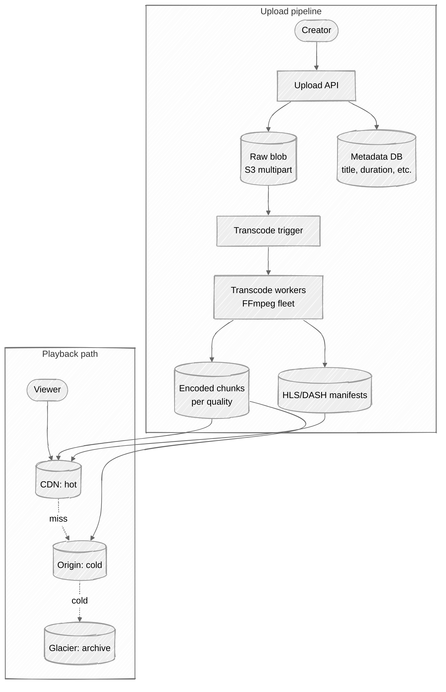
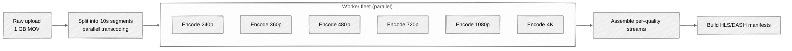
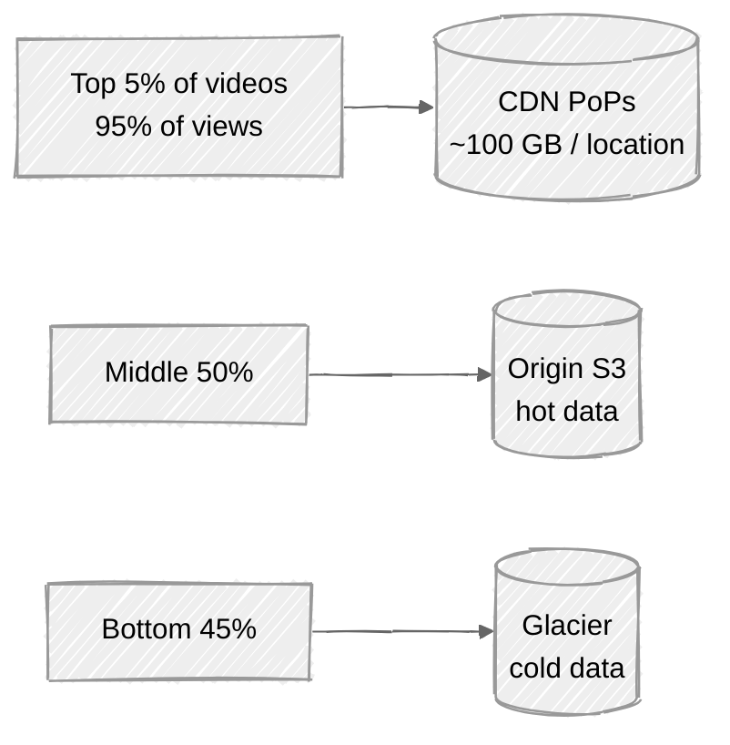

# Week 14: Video Streaming — Walkthrough

> ⏱️ **Time budget:** 45 minutes
> 🎯 **Goal:** Design the upload→transcode→store pipeline + CDN-first delivery, then defend the tier strategy.

---

## 1. Clarify scope (5 min)

- "VOD only, or live too? They're very different problems."
- "Are we designing the recommendation system, or just playback?"
- "Do we support live streaming, scrubbing, downloads?"
- "Is DRM in scope?"
- "What's the typical video length — short-form (TikTok-style 60s) or long-form (YouTube average 10 min)?"

> 💬 **How to say it:** "YouTube spans VOD, live, shorts, recommendations, ads — much more than 45 minutes. I'll design VOD playback as the core; live and recommendations would hang off this infrastructure but are separate problems."

## 2. Functional requirements

**In scope:**

- Upload a video file (the creator side)
- Transcode to multiple resolutions / bitrates (encoding ladder)
- Serve adaptive bitrate streams (HLS or DASH) to viewers
- CDN-fronted global delivery
- Cold vs. hot storage tiering

**Out of scope:**

- Live streaming (separate ingest + glass-to-glass latency design)
- Recommendation system / homepage feed
- Comments, likes, watch history
- Monetization / ad insertion
- DRM (acknowledge as additive complexity)
- Search

> 💬 **How to say it:** "VOD playback. Live streaming is a sister design — same storage/CDN, different ingest. I'll call out where the two diverge."

## 3. Non-functional requirements

| Concern | Target | Why |
|---|---|---|
| Upload throughput | ~30 GB/sec aggregate | 500 hours/min × ~100 MB/min average |
| Transcode latency | < 1 hour for normal video; < 5 min for popular creators | Acceptable freshness |
| Playback start latency | < 2s p99 (time to first frame) | The single most-measured user metric |
| Buffering rate | < 1% of playback time | Adaptive bitrate's whole job |
| Storage | ~1 EB (exabyte) — long tail of 13B+ videos | Per scale |
| Availability | 99.99% on viewing | Service-critical |

## 4. Back-of-envelope estimation

| Quantity | Value | Working |
|---|---|---|
| Upload volume | ~720k hours/day | 500 hr × 60 × 24 |
| Storage growth (compressed) | ~30 PB / day uploaded × 6 encodings × 0.3 compression = ~50 PB / day | encoding ladder explodes the per-video storage |
| Total catalog | ~1 EB | 13B videos × ~80 MB avg per encoding × 6 encodings |
| Viewing bandwidth | 5B hours / 86,400 = 58k concurrent streams × avg 3 Mbps = 175 Gbps | Massive |
| 95% from top 5% | Hot content is tiny fraction of catalog | Tier accordingly |

**Insight:** the storage cost dominates, not the compute. Transcoding is one-time; storage and bandwidth are forever. **The CDN strategy and storage tiering are the dominant design decisions.**

> 💬 **How to say it:** "Storage scale is the headline number — exabytes. The 95/5 distribution means almost all viewing is from a small set; that's what makes CDN tiering economical. Cold storage for the long tail isn't optional, it's mandatory."

## 5. API design

```
// Upload (the creator)
POST /v1/uploads/initiate                    -> { upload_id, upload_url (pre-signed) }
PUT  <pre-signed S3 url>                     // browser uploads directly to blob store
POST /v1/uploads/{upload_id}/complete        -> { video_id }

// Watch (the viewer)
GET /v1/videos/{id}/manifest                 // HLS / DASH manifest
  → m3u8 / mpd
GET /v1/videos/{id}/chunk/{quality}/{ts}    // 2-10s chunks
```

The HLS/DASH manifest is the index that tells the player "here are the available bitrates and their chunk URLs." The player switches bitrates between chunks based on observed bandwidth.

> 💬 **How to say it:** "Two surfaces — upload (browser → presigned S3 URL, direct upload skipping our service) and playback (manifest first, then chunks). The player decides which quality to fetch based on its measured throughput."

## 6. High-level architecture



Two pipelines. Upload is a fan-out batch job; playback is a CDN-driven read.

> 💬 **How to say it:** "Two halves. Upload is a batch pipeline — original to blob store, then a fleet of FFmpeg workers transcodes to the encoding ladder. Playback is CDN-first, origin-fallback, with cold tiering to Glacier for the long tail."

## 7. Deep dive: transcoding pipeline



**Key trick: chunked parallel transcoding.** Split a 10-minute video into 60 × 10-second chunks. Each chunk transcoded independently across the worker fleet. A 10-minute video can transcode in ~30 seconds with enough parallelism.

### Encoding ladder

| Quality | Resolution | Bitrate | Notes |
|---|---|---|---|
| 240p | 426×240 | ~400 kbps | Emerging markets, 2G |
| 360p | 640×360 | ~800 kbps | 3G |
| 480p | 854×480 | ~1.2 Mbps | Older devices |
| 720p | 1280×720 | ~2.5 Mbps | Default desktop |
| 1080p | 1920×1080 | ~5 Mbps | HD |
| 4K | 3840×2160 | ~15 Mbps | Premium |

For a 10-minute video at 1 GB raw, transcoded encodings sum to ~500 MB. Stored as 2-10 second chunks.

> 💬 **How to say it:** "Encoding ladder of 6 qualities. We chunk the video into 10-second segments, transcode each segment to each quality in parallel. Output is per-quality manifests pointing at chunk URLs. The player adapts bitrate between chunks."

### Why chunks, not single files

Adaptive bitrate requires that the player can **switch quality between segments**. Each 2-10s chunk is independently decodable. Player downloads chunk N at 720p, sees bandwidth drop, downloads chunk N+1 at 480p. No buffer underrun.

This also means each chunk is a separate file → CDN can cache hot chunks granularly, and chunks of less-popular qualities can be evicted independently.

## 8. Deep dive: CDN + storage tiering

The 95/5 rule does the heavy lifting here.



**Hot:** chunks cached in CDN PoPs globally. Cache hit ratio for popular videos ~98%.

**Warm:** chunks live in regional S3 buckets. Cache miss from CDN → origin fetch → CDN caches for next time. Latency penalty paid once.

**Cold:** chunks in Glacier (~50× cheaper per GB). First access has a retrieval lag (minutes for "expedited"); UX shows "preparing video" — acceptable for never-watched archive content.

### Promotion / demotion

A video that suddenly trends gets promoted: chunks pre-warmed into CDN PoPs.

A video that goes unwatched for 90 days gets demoted to cold.

This is an offline process — usage logs drive it.

> 💬 **How to say it:** "Three tiers, driven by access frequency. CDN PoPs for the hot tail, regional S3 for the warm middle, Glacier for the cold archive. Promotion and demotion are batch jobs that read access logs and shuffle chunks between tiers."

## 9. Bottlenecks + scaling

| Component | Hot spot | Mitigation |
|---|---|---|
| Upload bandwidth | 30 GB/sec aggregate | Direct upload to S3 via presigned URLs; never touches our service |
| Transcode compute | ~5M minutes of video / day | Worker fleet sized for ~30 min lag tolerance; spot instances for cost |
| CDN bandwidth | 175 Gbps+ to viewers | CDN provider handles; we pay the bill |
| CDN cache size | ~100 PB across PoPs | Top 5% only at each PoP; everything else fetched on demand |
| Storage cost | $$$ at exabyte scale | Tiering to Glacier; aggressive compression; delete-if-zero-views-in-N-years policies for low-quality uploads |
| Origin fetch under viral spike | 1 video suddenly goes viral; CDN cold-misses | Pre-warm hot content to nearest PoPs; rate-limit origin fetch with single-flight |

**The non-obvious one: viral cold-start.** A creator uploads, the video is in regional warm S3, and trending pushes 1M views in an hour. Each CDN PoP cold-misses simultaneously. Mitigation: **single-flight** at the origin (only one request to S3 per chunk per PoP) and pre-emptive replication to all PoPs as soon as the trending signal fires.

> 💬 **How to say it:** "The interesting failure mode is viral cold-start. A trending video has 100 CDN PoPs all asking the origin for the same chunks. Single-flight at the origin layer plus pre-emptive replication on trending signals avoids the origin getting demolished."

## 10. Tradeoffs + what you'd change

**What I picked:**

- Chunked HLS/DASH for adaptive bitrate
- Parallel transcoding pipeline
- CDN-first delivery with 3-tier storage (CDN / S3 / Glacier)
- Direct upload to S3 via pre-signed URLs
- Single-flight origin fetches

**What I chose against:**

- Single-file video downloads (no ABR, doesn't work on variable networks)
- Monolithic transcoding (one worker per video — too slow)
- Same storage class for all content (storage cost explodes)
- Synchronous transcode-on-upload (creators wait too long)

**Given more time, I'd dig into:**

- Live streaming (ingest from camera → segments → CDN with low latency; HLS / LL-HLS / WebRTC)
- DRM (Widevine, FairPlay, PlayReady) — chunks encrypted per-key
- Personalized encoding ladders (per-codec, per-device — VP9 / AV1 / H.265 / H.264)
- Pre-positioning new uploads from popular creators to CDN aggressively
- Smart compression — per-shot encoding (Netflix's encoding optimization)

> 💬 **How to say it:** "Those are the calls. The most interesting follow-up is live streaming — same chunked-storage idea, but the ingest path is real-time and the latency budget is glass-to-glass under 5 seconds, which forces LL-HLS or WebRTC instead of standard HLS."

---

## Common pitfalls

- **Monolithic video files.** No adaptive bitrate, no CDN-friendly granularity.
- **Synchronous transcoding on upload.** Creators wait 10 minutes; doesn't scale.
- **One storage tier.** Storage cost dominates at scale; tiering is mandatory.
- **Upload through your own servers.** Direct-to-S3 via presigned is the only viable path at this throughput.
- **No CDN strategy.** "Just put it in S3" doesn't deliver 175 Gbps with low latency.

See [interviewer-cues.md](interviewer-cues.md).
