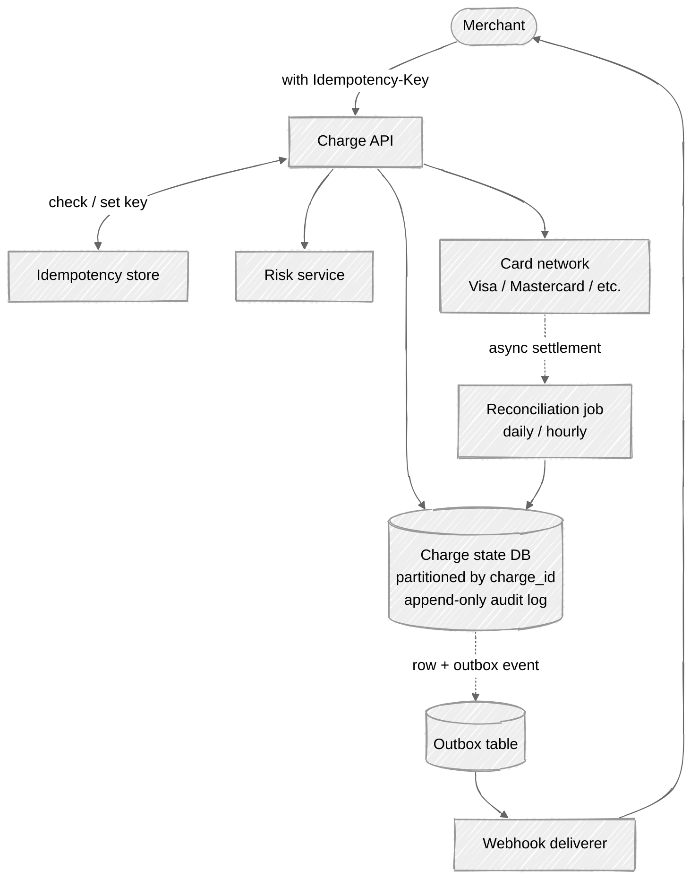
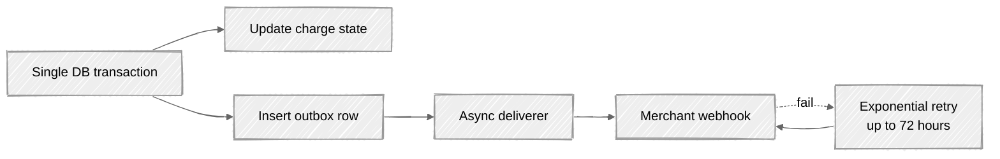

# Week 15: Payments + Idempotency — Walkthrough

> ⏱️ **Time budget:** 45 minutes
> 🎯 **Goal:** Land on idempotency-key-based dedup, a durable state machine per charge, and reconciliation as a first-class concern.

---

## 1. Clarify scope (5 min)

- "Are we designing the merchant-facing API (Stripe-style), or the underlying acquirer/processor?"
- "Do we support multi-step flows — authorize-then-capture, refunds, partial refunds, voids?"
- "Are we storing card numbers (full PCI scope) or using tokens (tokenization service handles cards)?"
- "Synchronous response required, or is async via webhook acceptable?"
- "Do we need to handle subscriptions / recurring billing, or one-off charges only?"

> 💬 **How to say it:** "Payments has many layers. I'll design the merchant API on top of a tokenization service. The hardest constraint is idempotency under network failure — once you've decided the result, you must always return that result for the same key."

## 2. Functional requirements

**In scope:**

- Create a charge: customer + amount + currency + payment method token
- Idempotency: retry with same key returns the original result, never double-charges
- Auth + capture two-step (separate from one-shot charge)
- Refunds (full and partial)
- Webhook delivery to merchants on state transitions

**Out of scope:**

- Card tokenization itself (separate PCI-in-scope service; we work with tokens)
- Fraud / risk scoring (separate service invoked synchronously)
- Subscription / recurring billing engine
- Merchant onboarding, KYC
- Payouts to merchant bank accounts

> 💬 **How to say it:** "Payment API on top of tokens. Tokenization is a separate problem with very different operational requirements — PCI scope, HSMs, the whole thing. I'm scoping that out."

## 3. Non-functional requirements

| Concern | Target | Why |
|---|---|---|
| Latency | < 500ms p99 | Card networks themselves are ~200-300ms |
| Throughput | 10k charges/sec peak | Per problem |
| Idempotency | 100% — never double-charge | Trust |
| Durability | 99.999999999% | Money — no data loss |
| Availability | 99.99% | Service-critical |
| Consistency | Strong on the charge state; eventual on derived data | Source-of-truth must be authoritative |
| Audit | Every state transition immutable, queryable | Regulatory + financial |

> 💬 **How to say it:** "The non-negotiable is idempotency. Card networks themselves can return after a timeout — we issue a charge, the network is slow, we time out, the network actually approves. We must reconcile that without double-charging, and we must always return a consistent result for a given idempotency key."

## 4. Back-of-envelope estimation

| Quantity | Value | Working |
|---|---|---|
| Charges/sec (peak) | 10k | Per problem |
| Charges/day (peak day) | ~50M | Black Friday-ish |
| Per-charge size | ~2 KB | request + response + metadata |
| Daily volume | ~100 GB | Easy to store |
| Idempotency key store | ~1B entries with 24h TTL | Bounded |
| Webhook deliveries / sec | ~10k | One per charge state transition |

**Insight:** the data volume is *small*. The hard part is **correctness under partial failure**, not scale.

> 💬 **How to say it:** "The throughput isn't the hard part — 10k req/sec is manageable. The hard part is the failure modes: networks dropping mid-request, card networks returning slowly, merchants retrying. Every design decision should ask 'what happens if this step fails?'"

## 5. API design

```
POST /v1/charges
Headers:
  Idempotency-Key: <UUID>            // required
Body:
  {
    "amount": 9999,                  // in cents
    "currency": "usd",
    "source": "tok_visa_xxx",        // tokenized card from tokenization service
    "customer": "cus_xxx",
    "capture": true,                 // false = auth-only
    "metadata": {...}
  }

Response (200 / 201):
  {
    "id": "ch_xxx",
    "status": "succeeded" | "pending" | "failed",
    "amount": 9999,
    "captured": true,
    "created": 1730000000,
    "balance_transaction": "txn_xxx"
  }
```

The `Idempotency-Key` is the contract. Same key + same request body → same response. Same key + *different* body → error (Stripe behavior).

```
POST /v1/charges/{id}/refund
  { amount?: 9999 }                  // omit = full refund

POST /v1/charges/{id}/capture
  { amount_to_capture?: ... }        // for auth-only flow
```

> 💬 **How to say it:** "Idempotency key in the header. Same key, same body → same response, forever. We persist the response for ~24 hours so retries even from the next day land correctly."

## 6. High-level architecture



Three principles:

1. **Idempotency check first.** Before doing anything else.
2. **Persist intent before calling the network.** "Pending" state in the DB *before* the network call, so a crash mid-call doesn't lose the fact that we tried.
3. **Reconciliation is mandatory.** The card network has its own ledger. They have to agree daily.

> 💬 **How to say it:** "Three things make this work: check the idempotency key first, persist 'I'm about to call the network' before calling, and reconcile against the network's own ledger daily. Anything less and money goes missing."

## 7. Deep dive: idempotency under failure

The classic flow has a fundamental hazard:

```
1. API receives request with key K
2. API calls card network — request sent
3. Network is processing
4. Client times out, retries with same key K
5. API receives retry
```

What does step 5 do?

| Approach | Outcome |
|---|---|
| Naive: "no record of K, must be new" | Sends *another* request to the network. Double-charge. |
| With idempotency store: "K is in-flight" | Waits for the in-flight one to finish; returns same result. |

The state machine:

```
key K not seen → in_flight (set with TTL) → succeeded / failed (persisted with response)
```

When a retry arrives:

- `succeeded` / `failed`: return the stored response. Don't call the network.
- `in_flight`: either return 409 ("still processing, retry later") or block-wait briefly and return result.

```python
def create_charge(idem_key, request_body):
    record = idem_store.get(idem_key)

    if record is None:
        # First time seeing this key
        success = idem_store.set_nx(idem_key, "in_flight", request_hash=hash(body), ttl=24h)
        if not success:
            # Another concurrent request just got it — fall through to retry handling
            return handle_concurrent(idem_key, body)

        # We are the canonical request — call the network
        result = call_card_network(body)
        idem_store.set(idem_key, "completed", response=result)
        return result

    if record.request_hash != hash(request_body):
        return error("idempotency key reused with different body", 409)

    if record.state == "completed":
        return record.response

    if record.state == "in_flight":
        # Wait briefly, then either return cached or 409
        ...
```

### The card-network timeout case

What if our call to the network times out? The network may have processed it. We don't know.

```mermaid
---
config:
  look: handDrawn
  theme: neutral
---
flowchart LR
    Send[We send charge]
    Wait[Wait]
    Timeout{Timeout?}
    Idem[Mark in DB:<br/>"unknown — needs<br/>reconciliation"]
    Network[Card network]
    Recon[Reconciliation job:<br/>query network the<br/>next day]
    Match{Found in network?}
    Match2["Match found:<br/>update to succeeded"]
    Match3["Not found:<br/>mark failed,<br/>safe to retry"]

    Send --> Wait --> Timeout
    Timeout -->|yes| Idem
    Network -.->|"processed or not?"| Recon
    Idem --> Recon
    Recon --> Match
    Match -->|yes| Match2
    Match -->|no| Match3
```

We **do not retry** the customer's call automatically. We mark the charge as "in_doubt." Reconciliation against the network's settlement file the next day resolves it.

If a merchant retries with the same idempotency key while we're in this state, we return 409 ("processing, check later"). Modal and explicit — no silent double-charges.

> 💬 **How to say it:** "The dangerous failure mode is a card-network timeout — we don't know if the charge succeeded. We do *not* retry. We mark in_doubt, return a status that says 'don't retry without checking,' and let the daily reconciliation resolve it. This is the only correct behavior — silently retrying causes double-charges."

## 8. Deep dive: the ledger + outbox

Every state transition is **append-only**.

```
charge_events (immutable)
─────────────────────────────────────────────
event_id     UUID
charge_id    VARCHAR
event_type   ENUM (created, authorized, captured, refunded, voided, failed)
amount_cents INT
metadata     JSON
created_at   TIMESTAMP

charges (projection of events)
─────────────────────────────────────────────
charge_id    VARCHAR PK
state        ENUM
amount       INT
captured     BOOL
refunded     BOOL
...
```

The events table is the source of truth — audit-trail compliant, never updated. The `charges` table is a derived projection rebuilt from events.

**Outbox pattern** for webhooks:

When state changes, the same DB transaction writes:

- Row to `charges` (or new event)
- Row to `outbox` (the webhook to deliver)

A separate deliverer reads `outbox`, sends webhooks, marks delivered. The transaction guarantees: if the state changed, the webhook will be delivered. No dual-write race.



> 💬 **How to say it:** "Outbox pattern. State change and webhook record happen in one transaction. The webhook deliverer is a separate consumer with retries spanning 72 hours. No event is lost, and the deliverer is decoupled from the API."

## 9. Bottlenecks + scaling

| Component | Hot spot | Mitigation |
|---|---|---|
| Idempotency store | Hot lookup on every request | Redis cluster; partition by key hash |
| Card network | External, not under our control; ~300ms latency | Connection pool; per-network rate budgeting |
| Charge state DB | 10k inserts/sec peak | Sharded by charge_id (or customer_id); append-only |
| Webhook deliverer | 10k outgoing HTTP/sec | Stateless; horizontally scaled |
| Reconciliation | Daily job over yesterday's charges | Spark / batch; reads from event log |
| Risk service | Synchronous on every charge | Cache risk scores per (customer, payment-method) for short windows |

**The non-obvious one:** the card network is the bottleneck you can't scale. If Visa is slow, you're slow. Mitigations:

- Per-network circuit breakers (if Visa is at 50% error rate, route declines for new requests to a fast-fail path).
- Backpressure to clients: 429s when downstream is unhealthy, with explicit `Retry-After`.

> 💬 **How to say it:** "The card network is your hard floor — you can't make it faster. What you *can* do is detect when it's unhealthy and fail fast or route around the affected card type, so a Visa outage doesn't take down your Mastercard traffic."

## 10. Tradeoffs + what you'd change

**What I picked:**

- Idempotency key required at the API
- Append-only event log + projected state
- Outbox pattern for webhooks
- Synchronous risk check, async settlement reconciliation
- In_doubt status with daily reconciliation against network ledger

**What I chose against:**

- Two-phase commit with the network (the network doesn't speak 2PC)
- Synchronous webhook delivery (couples downstream availability to ours)
- Implicit retries (causes double-charges)
- Update-in-place charge rows (no audit trail)
- One big SQL transaction across services (saga is preferred)

**Given more time, I'd dig into:**

- Fraud / risk pipelines (real-time + offline ML scoring)
- Subscription billing (cron-driven scheduling on top of this API)
- Multi-currency settlement and FX
- Dispute / chargeback handling (long async workflow over months)
- Tokenization service in detail (HSMs, PCI scope minimization)

> 💬 **How to say it:** "Those are the calls. The most interesting follow-up is dispute handling — chargebacks arrive weeks after the original charge and have their own state machine, evidence requirements, and accounting implications. Whole separate design."

---

## Common pitfalls

- **Retrying card network calls automatically.** Causes double-charges.
- **Optional idempotency keys.** Make them required, always.
- **No reconciliation.** Network can disagree silently; you must compare ledgers.
- **Synchronous webhooks in the charge API.** Webhook 5xx becomes your 5xx.
- **Updating charge rows in place.** Loses audit trail.
- **Treating the network as if it were 2PC.** It isn't; design around its actual semantics.

See [interviewer-cues.md](interviewer-cues.md).
