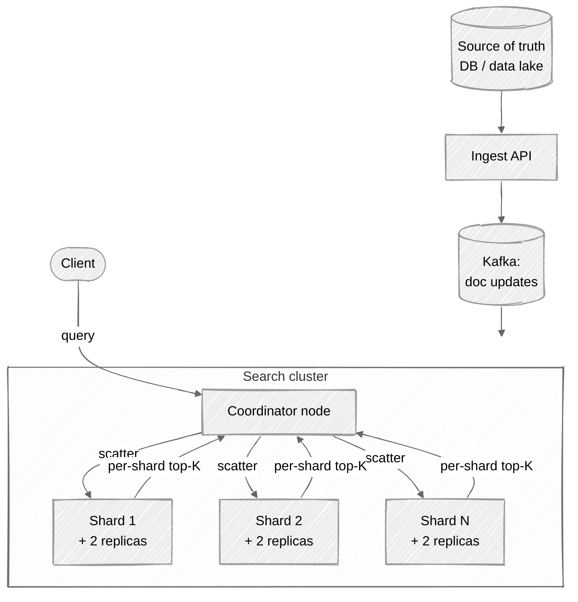
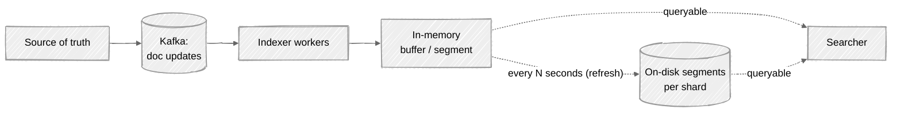

# Week 16: Distributed Search — Walkthrough

> ⏱️ **Time budget:** 45 minutes
> 🎯 **Goal:** Inverted index per shard, document-partitioned cluster, scatter-gather queries; defend the partitioning choice and near-real-time pipeline.

---

## 1. Clarify scope (5 min)

- "What are the document types — text-heavy (articles), structured (e-commerce products), or both?"
- "Query types — pure keyword, faceted aggregations, geo, semantic / vector? Different problems."
- "Strict consistency on indexing latency, or 'near real-time' (~1 min) acceptable?"
- "Do we support full re-index from source, or only incremental writes?"
- "Are deletes supported, or append-only?"

> 💬 **How to say it:** "Search is a big surface. The two biggest design forks are (a) what kinds of queries we support beyond keyword, and (b) how fresh the index must be. I'll confirm those before designing."

## 2. Functional requirements

**In scope:**

- Index documents (insert, update, delete)
- Keyword search with relevance scoring (BM25 or similar)
- Faceted aggregations alongside keyword results
- Near-real-time indexing (~1 min freshness)
- Pagination of results

**Out of scope:**

- Semantic / vector search (different index structure; ANN)
- Geographic search (separate spatial index)
- Cross-cluster federation
- Snapshot / backup mechanics (operational concern)
- Query auto-complete (separate problem — see [Week 07](../week-07-search-autocomplete/))

> 💬 **How to say it:** "Keyword search + facets, near-real-time. Vector / semantic search is a different beast — it uses HNSW or IVF, not an inverted index. I'd build it as a sibling system."

## 3. Non-functional requirements

| Concern | Target | Why |
|---|---|---|
| Query latency | p99 < 200ms | Search-bar feel |
| Indexing latency | < 1 min from doc → searchable | "Near real-time" |
| QPS | 100k peak | Per problem |
| Index size | ~5-10× the source doc size | Inverted index overhead |
| Availability | 99.99% | Service-critical |
| Durability | Index is reconstructible; durability is on the source | Common pattern |

> 💬 **How to say it:** "I'll lean on the assumption that the index is *reconstructible* from a source of truth — the durability requirement lives elsewhere. Search clusters get rebuilt, not preserved indefinitely."

## 4. Back-of-envelope estimation

| Quantity | Value | Working |
|---|---|---|
| Documents | 100B | Per problem |
| Source size | ~200 TB | 100B × 2 KB |
| Inverted index size | ~1-2 PB | 5-10× expansion |
| Queries/sec | 100k | Per problem |
| Shards | ~1,000 | Each shard ~1-2 TB |
| Replicas per shard | 2 | Read throughput + durability |
| Total cluster size | ~3,000 nodes worth of disk | Sharded across many machines |
| Indexing throughput | ~10k docs/sec sustained | Reasonable target |

**Insight:** the index size is what dictates the cluster topology. ~1,000 shards is a meaningful number — small enough to be coordinated by a master, large enough to spread the workload.

> 💬 **How to say it:** "About 1,000 shards across the cluster, each ~1-2 TB. That's the topology — enough to spread load and small enough to be tractable to coordinate."

## 5. API design

```
PUT /v1/index/{doc_id}
  { title: "...", body: "...", category: "...", tags: [...], created_at: ... }

POST /v1/search
  {
    "query": {
      "match": { "body": "rate limiter design" }
    },
    "filters": [{ "term": { "category": "engineering" }}],
    "aggregations": {
      "by_category": { "terms": { "field": "category", "size": 10 } }
    },
    "from": 0,
    "size": 20
  }
Response:
  {
    "took_ms": 145,
    "hits": [{ doc_id, score, source: {...}}],
    "total": 1247,
    "aggregations": { "by_category": [...] }
  }
```

> 💬 **How to say it:** "ES-style JSON API. The interesting bit is that a single request can carry the keyword query, the filters, the facets, and pagination — all answered in one round trip."

## 6. High-level architecture



The coordinator is **any node** in the cluster (load-balanced). It fan-outs ("scatters") the query to each shard, gathers per-shard top-K results, merges, and returns.

> 💬 **How to say it:** "Scatter-gather. Any node can coordinate a query. It hits every primary shard in parallel, each shard returns its top K matches, the coordinator merges, sorts, and returns the global top-K."

## 7. Deep dive: partitioning — document vs. term

This is the single most important design decision.

### Document partitioning (✅ what everyone uses)

Each shard holds a complete inverted index for **a subset of documents**.

```
Shard 1: docs 1 - 100M, inverted index for those docs
Shard 2: docs 100M+1 - 200M, inverted index for those docs
...
```

Query path: scatter to all shards (each searches its subset), gather top-K per shard, merge.

| Pros | Cons |
|---|---|
| Easy to add capacity (add shards) | Query hits every shard (no pruning by query) |
| Indexing is local (write goes to one shard) | Aggregations require cluster-wide merge |
| Replicas are straightforward | |

### Term partitioning (almost no one uses)

Each shard holds the inverted index for **a subset of terms**.

```
Shard 1: terms starting with a-m
Shard 2: terms starting with n-z
```

Query path: query goes only to shards holding the queried terms.

| Pros | Cons |
|---|---|
| Query hits fewer shards | Indexing a single doc updates many shards (one per term) |
| | Term-frequency skew → uneven shards |
| | Hot terms create hot shards |

**Why everyone uses document partitioning:** indexing simplicity + balanced shards beats the per-query pruning benefit. Elasticsearch, Solr, OpenSearch all do this.

> 💬 **How to say it:** "Document partitioning. Each shard is a self-contained inverted index for its slice of documents. Queries scatter to all shards. The alternative — term partitioning — sounds cheaper for queries but makes indexing terrible. Nobody runs it in production."

## 8. Deep dive: the indexing pipeline + near-real-time



**Lucene's trick (which everyone copies):** segments.

- Documents go into an in-memory segment.
- Every ~1 second, the segment is *refreshed* — promoted to an immutable on-disk file that's queryable.
- Background compaction merges small segments into larger ones (LSM-tree style).

**Why segments instead of mutable indices?**

- Segments are immutable → no locking on reads.
- Append-only writes are cheap.
- Compaction happens off the hot path.

Deletes are *tombstones* in newer segments; compaction physically removes them later.

> 💬 **How to say it:** "Lucene-style segments. Writes go into an in-memory buffer, refreshed to disk every second. Each segment is immutable — readers don't lock against writers. Compaction merges small segments into larger ones in the background. Standard LSM-tree pattern but adapted for inverted indexes."

### Replication

Each primary shard has N replicas (typically 1-2). When a doc indexes:

1. Write to primary shard's buffer.
2. Replicate to N replica shards.
3. Ack to client when primary + at least one replica have it.

For queries, the coordinator can route to *any* copy of each shard — primary or replica. This is where read throughput scales: more replicas = more parallel query capacity.

## 9. Bottlenecks + scaling

| Component | Hot spot | Mitigation |
|---|---|---|
| Per-shard query | One shard searches a deep index | Optimize: cache hot terms, BM25 short-circuiting (don't score docs that can't be top-K) |
| Scatter-gather | Query latency = slowest shard | "Hedged" requests — issue duplicate queries to slow shards |
| Hot shards | Skewed document distribution | Custom routing key; rebalance periodically |
| Indexing throughput | 10k docs/sec → bursts higher | Per-shard ingest; partition by routing key |
| Aggregation cost | Cross-shard merges can be expensive | Approximate algorithms (HyperLogLog, top-K with cardinality estimation) for facets |
| Memory pressure | Indices want to live in RAM | Mmap + OS page cache; sized for hot working set |

**The non-obvious one: query tail latency.** A scatter to 1,000 shards has p99 = max(p99 of each shard). One slow shard slows the whole query.

Mitigations:

- **Hedged requests:** if the 95th-percentile shard hasn't responded in 50ms, fire a duplicate request to a replica. Cancel whichever loses.
- **Adaptive shard selection:** prefer replicas that have been faster recently.
- **Partial results on timeout:** return what came back; flag the response as incomplete.

> 💬 **How to say it:** "Tail latency is the headline. Scatter-gather makes you wait for the slowest shard. Hedged requests against replicas + adaptive routing solve most of it. For the residual, returning partial results with a flag is acceptable for search — better than failing entirely."

## 10. Tradeoffs + what you'd change

**What I picked:**

- Document partitioning across ~1,000 shards
- Lucene-style immutable segments + background compaction
- Async replication, primary + 2 replicas
- Scatter-gather queries with hedged requests
- Source of truth elsewhere; index is reconstructible

**What I chose against:**

- Term partitioning (write amplification; uneven shards)
- Synchronous replication (latency cost)
- Mutable indices (locking issues)
- One giant shard (no parallel query)
- Index as source of truth (durability is hard; recovery is harder)

**Given more time, I'd dig into:**

- Vector / semantic search (HNSW + IVF; very different data structures)
- Cross-cluster replication / federation
- Index lifecycle management (hot / warm / cold tiers by age)
- Snapshot strategy
- Query rewriting and synonyms
- Multi-tenant isolation in a shared cluster

> 💬 **How to say it:** "Those are the calls. The most interesting follow-up is hybrid search — combining BM25 keyword search with vector similarity. Same cluster idea, but with HNSW indexes alongside the inverted index. That's how modern semantic search engines actually work."

---

## Common pitfalls

- **Picking term partitioning.** Sounds right on paper, terrible in practice.
- **Mutable indices.** Locking will kill you.
- **Synchronous replication on every write.** Indexing latency blows up.
- **No tail-latency mitigation.** One slow shard = slow query.
- **Index as source of truth.** Search clusters die; have a reconstructible source.

See [interviewer-cues.md](interviewer-cues.md).
